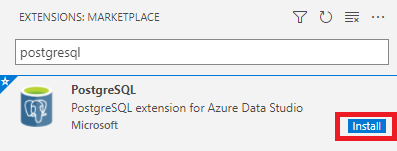
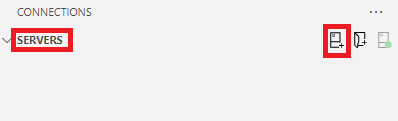

---
lab:
  title: 使用客户端工具探索 PostgreSQL
  module: Understand client-server communication in PostgreSQL
---

# 使用客户端工具探索 PostgreSQL

在本练习中，你将下载并安装 psql 和 Azure Data Studio。 如果计算机上已安装 Azure Data Studio，则可以跳转到“连接到 Azure Database for PostrgreSQL 灵活服务器”。

## 开始之前

需要有自己的 Azure 订阅才能完成本练习。 如果还没有 Azure 订阅，可以创建一个 [Azure 免费试用版](https://azure.microsoft.com/free)。

## 创建练习环境

在本练习和以后的所有练习中，你将在 Azure Cloud Shell 中使用 Bicep 来部署 PostgreSQL 服务器。

### 在你的 Azure 订阅上部署资源

此步骤指导你使用 Azure Cloud Shell 中的 Azure CLI 命令创建资源组并运行 Bicep 脚本，以将完成此练习所需的 Azure 服务部署到你的 Azure 订阅中。

> 注意
>
> 如果你要在此学习路径中执行多个模块，则可以在它们之间共享 Azure 环境。 在这种情况下，你只需完成此资源部署步骤一次。

1. 打开 web 浏览器，导航到 [Azure 门户](https://portal.azure.com/)。

2. 选择 Azure 门户工具栏中的“ **Cloud Shell** ”图标，以打开浏览器窗口底部的新“ [Cloud Shell](https://learn.microsoft.com/azure/cloud-shell/overview) ”窗格。

    

3. 如果出现提示，请选择打开 *Bash* shell 所需的选项。 如果以前使用过 *PowerShell* 控制台，请将其切换到 *Bash* shell。

4. 在 Cloud Shell 提示符下，输入以下内容以克隆包含练习资源的 GitHub 存储库：

    ```bash
    git clone https://github.com/MicrosoftLearning/mslearn-postgresql.git
    ```

5. 接下来，运行三个命令来定义变量，以在使用 Azure CLI 命令创建 Azure 资源时减少冗余键入。 变量表示要分配给资源组的名称（`RG_NAME`）、要将资源部署到的 Azure 区域（`REGION`）和随机生成的 PostgreSQL 管理员登录密码（`ADMIN_PASSWORD`）。

    在第一个命令中，分配给相应变量的区域是 `eastus`，但你也可以将其替换为首选位置。

    ```bash
    REGION=eastus
    ```

    以下命令分配要用于资源组的名称，该资源组将容纳本练习中使用的所有资源。 分配给相应变量的资源组名称是 `rg-learn-work-with-postgresql-$REGION`，其中 `$REGION` 是上文指定的位置。 但是，你可以将它更改为符合偏好的任何其他资源组名称。

    ```bash
    RG_NAME=rg-learn-work-with-postgresql-$REGION
    ```

    最后一个命令随机生成 PostgreSQL 管理员登录的密码。 请确保将其复制到安全位置，以便稍后可以使用它连接到 PostgreSQL 灵活服务器。

    ```bash
    a=()
    for i in {a..z} {A..Z} {0..9}; 
       do
       a[$RANDOM]=$i
    done
    ADMIN_PASSWORD=$(IFS=; echo "${a[*]::18}")
    echo "Your randomly generated PostgreSQL admin user's password is:"
    echo $ADMIN_PASSWORD
    ```

6. 如果有权访问多个 Azure 订阅，并且默认订阅不是要为此练习创建资源组和其他资源的订阅，请运行此命令来设置相应的订阅，将 `<subscriptionName|subscriptionId>` 令牌替换为要使用的订阅的名称或 ID：

    ```azurecli
    az account set --subscription <subscriptionName|subscriptionId>
    ```

7. 运行以下 Azure CLI 命令创建资源组：

    ```azurecli
    az group create --name $RG_NAME --location $REGION
    ```

8. 最后，使用 Azure CLI 执行 Bicep 部署脚本，在资源组中预配 Azure 资源：

    ```azurecli
    az deployment group create --resource-group $RG_NAME --template-file "mslearn-postgresql/Allfiles/Labs/Shared/deploy-postgresql-server.bicep" --parameters adminLogin=pgAdmin adminLoginPassword=$ADMIN_PASSWORD
    ```

    Bicep 部署脚本将完成此练习所需的 Azure 服务预配到你的资源组中。 部署的资源是 Azure Database for PostgreSQL - 灵活服务器。 bicep 脚本还会创建一个数据库 - 该数据库可在命令行上配置为参数。

    部署需要数分钟才能完成。 你可以从 Cloud Shell 监视它，也可以导航到上述创建的资源组的“**部署**”页面，在那里观察部署进度。

8. 完成资源部署后，关闭 Cloud Shell 窗格。

### 排查部署错误

运行 Bicep 部署脚本时可能会遇到一些错误。 最常见的消息和解决它们的步骤包括：

- 如果你以前为此学习路径运行过 Bicep 部署脚本并随后删除了资源，如果在删除资源后 48 小时内尝试重新运行该脚本，可能会收到如下所示的错误消息：

    ```bash
    {"code": "InvalidTemplateDeployment", "message": "The template deployment 'deploy' is not valid according to the validation procedure. The tracking id is '4e87a33d-a0ac-4aec-88d8-177b04c1d752'. See inner errors for details."}
    
    Inner Errors:
    {"code": "FlagMustBeSetForRestore", "message": "An existing resource with ID '/subscriptions/{subscriptionId}/resourceGroups/rg-learn-postgresql-ai-eastus/providers/Microsoft.CognitiveServices/accounts/{accountName}' has been soft-deleted. To restore the resource, you must specify 'restore' to be 'true' in the property. If you don't want to restore existing resource, please purge it first."}
    ```

    如果收到此消息，请修改上述 `azure deployment group create` 命令，将 `restore` 参数设置为 `true`，然后重新运行。

- 如果所选区域受限于预配特定资源，则必须将 `REGION` 变量设置为其他位置，然后重新运行命令以创建资源组并运行 Bicep 部署脚本。

    ```bash
    {"status":"Failed","error":{"code":"DeploymentFailed","target":"/subscriptions/{subscriptionId}/resourceGroups/{resourceGrouName}/providers/Microsoft.Resources/deployments/{deploymentName}","message":"At least one resource deployment operation failed. Please list deployment operations for details. Please see https://aka.ms/arm-deployment-operations for usage details.","details":[{"code":"ResourceDeploymentFailure","target":"/subscriptions/{subscriptionId}/resourceGroups/{resourceGroupName}/providers/Microsoft.DBforPostgreSQL/flexibleServers/{serverName}","message":"The resource write operation failed to complete successfully, because it reached terminal provisioning state 'Failed'.","details":[{"code":"RegionIsOfferRestricted","message":"Subscriptions are restricted from provisioning in this region. Please choose a different region. For exceptions to this rule please open a support request with Issue type of 'Service and subscription limits'. See https://review.learn.microsoft.com/en-us/azure/postgresql/flexible-server/how-to-request-quota-increase for more details."}]}]}}
    ```

- 如果脚本由于接受负责任的 AI 协议的要求而无法创建 AI 资源，则可能会遇到以下错误：在这种情况下，使用 Azure 门户用户界面创建 Azure AI 服务资源，然后重新运行部署脚本。

    ```bash
    {"code": "InvalidTemplateDeployment", "message": "The template deployment 'deploy' is not valid according to the validation procedure. The tracking id is 'f8412edb-6386-4192-a22f-43557a51ea5f'. See inner errors for details."}
     
    Inner Errors:
    {"code": "ResourceKindRequireAcceptTerms", "message": "This subscription cannot create TextAnalytics until you agree to Responsible AI terms for this resource. You can agree to Responsible AI terms by creating a resource through the Azure Portal then trying again. For more detail go to https://go.microsoft.com/fwlink/?linkid=2164190"}
    ```

## 用于连接到 PostgreSQL 的客户端工具

### 连接到带有 psql 的 Azure Database for PostgreSQL

可以在本地安装 psql 或从 Azure 门户进行连接，这将打开 Cloud Shell 并提示输入管理员帐户的密码。

#### 在本地连接

1. 从[此处](https://sbp.enterprisedb.com/getfile.jsp?fileid=1258893)安装 psql。
    1. 在设置向导中，在****“选择组件”对话框中选择“命令行工具”****。
    > 注意
    >
    > 要检查 **psql** 是否已安装在你的环境中，请打开命令行/终端并运行命令 ***psql***。 如果它返回一条消息，如“*psql: error: connection to server on socket...*”，这意味着 **psql** 工具已在环境中安装，并且无需重新安装它。


1. 打开命令行。
1. 连接到服务器的语法是：

    ```sql
    psql --h <servername> --p <port> -U <username> <dbname>
    ```

1. 在命令提示符处输入 **`--host=<servername>.postgres.database.azure.com`** 其中 `<servername>` 是上面创建的 Azure Database for PostgreSQL 的名称。
    1. 可以在 Azure 门户 或 bicep 脚本的输出中找到“**概述**”中的服务器名称。

    ```sql
   psql -h <servername>.postgres.database.azure.com -p 5432 -U pgAdmin postgres
    ```

    1. 系统会提示输入上面复制的管理员帐户密码。

1. 要在提示符处创建一个空白数据库，请键入：

    ```sql
    CREATE DATABASE mypgsqldb;
    ```

1. 出现提示时，请执行以下命令，将连接切换到新建的数据库 mypgsqldb：

    ```sql
    \c mypgsqldb
    ```

1. 现在已连接到服务器，并创建了一个数据库，可以执行熟悉的 SQL 查询，例如在数据库中创建表：

    ```sql
    CREATE TABLE inventory (
        id serial PRIMARY KEY,
        name VARCHAR(50),
        quantity INTEGER
        );
    ```

1. 将数据加载到表

    ```sql
    INSERT INTO inventory (id, name, quantity) VALUES (1, 'banana', 150);
    INSERT INTO inventory (id, name, quantity) VALUES (2, 'orange', 154);
    ```

1. 查询和更新表中的数据

    ```sql
    SELECT * FROM inventory;
    ```

1. 更新表中的数据。

    ```sql
    UPDATE inventory SET quantity = 200 WHERE name = 'banana';
    ```

## 安装 Azure Data Studio

> 注意
>
> 如果已安装 Azure Data Studio，请转到“*安装 PostgreSQL 扩展*”步骤。

安装 Azure Data Studio 以用于 Azure Database for PostgreSQL：

1. 在浏览器中，导航到[下载并安装 Azure Data Studio](https://go.microsoft.com/fwlink/?linkid=2282284)，然后在 Windows 平台下，选择“用户安装程序(推荐)”。 可执行文件将下载到“下载”文件夹。
1. 选择“打开文件”。
1. 此时将显示“许可协议”。 阅读并接受协议，然后选择“下一步”。
1. 在“选择其他任务”中，选择“添加到 PATH”以及所需的任何其他添加内容。 选择**下一步**。
1. 此时将显示“准备安装”对话框。 复查你的设置。 选择“返回”进行更改，或选择“安装”。
1. 此时将显示“正在完成 Azure Data Studio 安装向导”对话框。 选择“完成”。 Azure Data Studio 启动。

## 安装 PostgreSQL 扩展

1. 如果 Azure Data Studio 尚未打开，请将其打开。
2. 在左侧菜单中，选择“扩展”以显示“扩展”面板。
3. 在搜索栏中，输入“PostgreSQL”。 将显示 Azure Data Studio 的 PostgreSQL 扩展图标。
   

   
4. 选择“安装”  。 扩展安装。

## 连接到 Azure Database for PostgreSQL 灵活服务器

1. 如果 Azure Data Studio 尚未打开，请将其打开。
2. 从左侧菜单中，选择“连接”。
   


3. 选择**新建连接**。
   


4. 在“连接详细信息”下的“连接类型”中，从下拉列表中选择“PostgreSQL”。
5. 在“服务器名称”中，输入 Azure 门户上显示的完整服务器名称。
6. 在“身份验证类型”中，保留密码。
7. 在“用户名和密码”中，输入用户名 **pgAdmin** 和上面创建的**随机管理员密码**。
8. 选择 [ x ] 记住密码。
9. 其余字段是可选的。
10. 选择“连接” 。 你已连接到 Azure Database for PostgreSQL 服务器。
11. 将显示服务器数据库的列表。 这包括系统数据库和用户数据库。

## 创建 zoo 数据库

1. 导航到包含练习脚本文件的文件夹，或者从 [MSLearn PostgreSQL Labs](https://github.com/MicrosoftLearning/mslearn-postgresql/tree/main/Allfiles/Labs/02) 下载 **Lab2_ZooDb.sql**。
1. 如果 Azure Data Studio 尚未打开，请将其打开。
1. 选择“**文件**”、“**打开文件**”，然后导航到保存脚本的文件夹。 选择 **../Allfiles/Labs/02/Lab2_ZooDb.sql** 和“**打开**”。
   1. 突出显示 **DROP** 和 **CREATE** 语句并运行它们。
   1. 在屏幕顶部，使用下拉箭头显示服务器上的数据库，包括 zoodb 和系统数据库。 选择“ **zoodb** ”数据库。
   1. 突出显示 **Create tables**、**Create foreign keys** 和 **Populate tables** 部分并运行它们。
   1. 突出显示脚本末尾的 3 个 **SELECT** 语句，并运行它们以验证表是否已创建和填充。
