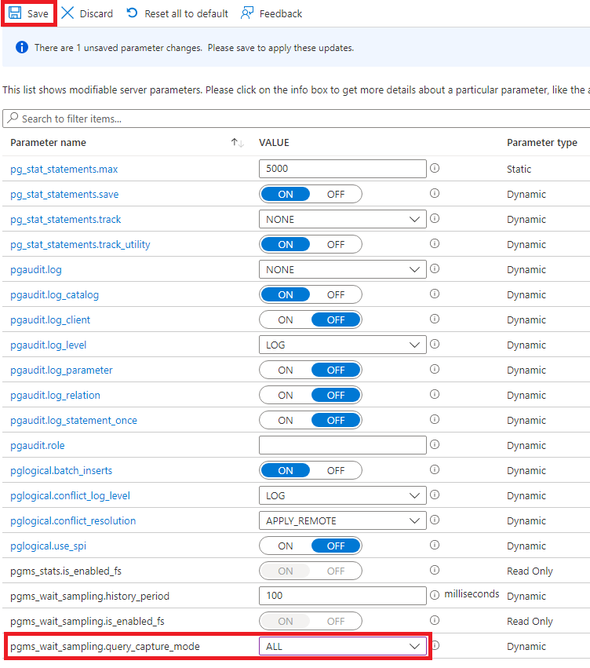
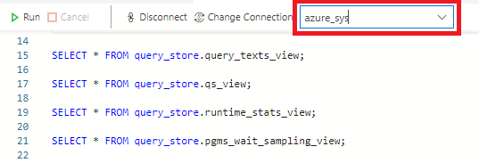

---
lab:
  title: 使用查询存储评估查询性能
  module: Tune queries in Azure Database for PostgreSQL
---

# 使用查询存储评估查询性能

在本练习中，了解如何使用 Azure Database for PostgreSQL 中的查询存储查询性能指标。

## 开始之前

你需要自己的 Azure 订阅才能完成此模块中的练习。 如果没有 Azure 订阅，可以在[使用 Azure 免费帐户在云中构建](https://azure.microsoft.com/free/)设置免费试用帐户。

## 创建练习环境

### 在你的 Azure 订阅上部署资源

此步骤指导你使用 Azure Cloud Shell 中的 Azure CLI 命令创建资源组并运行 Bicep 脚本，以将完成此练习所需的 Azure 服务部署到你的 Azure 订阅中。

1. 打开 web 浏览器，导航到 [Azure 门户](https://portal.azure.com/)。

2. 选择 Azure 门户工具栏中的“ **Cloud Shell** ”图标，以打开浏览器窗口底部的新“ [Cloud Shell](https://learn.microsoft.com/azure/cloud-shell/overview) ”窗格。

    

    如果出现提示，请选择打开 *Bash* shell 所需的选项。 如果以前使用过 *PowerShell* 控制台，请将其切换到 *Bash* shell。

3. 在 Cloud Shell 提示符下，输入以下内容以克隆包含练习资源的 GitHub 存储库：

    ```bash
    git clone https://github.com/MicrosoftLearning/mslearn-postgresql.git
    ```

4. 接下来，运行三个命令来定义变量，以在使用 Azure CLI 命令创建 Azure 资源时减少冗余键入。 变量表示要分配给资源组的名称（`RG_NAME`）、要将资源部署到的 Azure 区域（`REGION`）和随机生成的 PostgreSQL 管理员登录密码（`ADMIN_PASSWORD`）。

    在第一个命令中，分配给相应变量的区域是 `eastus`，但你也可以将其替换为首选位置。

    ```bash
    REGION=eastus
    ```

    以下命令分配要用于资源组的名称，该资源组将容纳本练习中使用的所有资源。 分配给相应变量的资源组名称是 `rg-learn-work-with-postgresql-$REGION`，其中 `$REGION` 是上文指定的位置。 但是，你可以将它更改为符合偏好的任何其他资源组名称。

    ```bash
    RG_NAME=rg-learn-work-with-postgresql-$REGION
    ```

    最后一个命令随机生成 PostgreSQL 管理员登录的密码。 请确保将其复制到安全位置，以便稍后可以使用它连接到 PostgreSQL 灵活服务器。

    ```bash
    a=()
    for i in {a..z} {A..Z} {0..9}; 
       do
       a[$RANDOM]=$i
    done
    ADMIN_PASSWORD=$(IFS=; echo "${a[*]::18}")
    echo "Your randomly generated PostgreSQL admin user's password is:"
    echo $ADMIN_PASSWORD
    ```

5. 如果有权访问多个 Azure 订阅，并且默认订阅不是要为此练习创建资源组和其他资源的订阅，请运行此命令来设置相应的订阅，将 `<subscriptionName|subscriptionId>` 令牌替换为要使用的订阅的名称或 ID：

    ```azurecli
    az account set --subscription <subscriptionName|subscriptionId>
    ```

6. 运行以下 Azure CLI 命令创建资源组：

    ```azurecli
    az group create --name $RG_NAME --location $REGION
    ```

7. 最后，使用 Azure CLI 执行 Bicep 部署脚本，在资源组中预配 Azure 资源：

    ```azurecli
    az deployment group create --resource-group $RG_NAME --template-file "mslearn-postgresql/Allfiles/Labs/Shared/deploy-postgresql-server.bicep" --parameters adminLogin=pgAdmin adminLoginPassword=$ADMIN_PASSWORD databaseName=adventureworks
    ```

    Bicep 部署脚本将完成此练习所需的 Azure 服务预配到你的资源组中。 部署的资源是 Azure Database for PostgreSQL - 灵活服务器。 bicep 脚本还会创建一个数据库 - 该数据库可在命令行上配置为参数。

    部署需要数分钟才能完成。 你可以从 Cloud Shell 监视它，也可以导航到上述创建的资源组的“**部署**”页面，在那里观察部署进度。

8. 完成资源部署后，关闭 Cloud Shell 窗格。

### 排查部署错误

运行 Bicep 部署脚本时可能会遇到一些错误。 最常见的消息和解决它们的步骤包括：

- 如果你以前为此学习路径运行过 Bicep 部署脚本并随后删除了资源，如果在删除资源后 48 小时内尝试重新运行该脚本，可能会收到如下所示的错误消息：

    ```bash
    {"code": "InvalidTemplateDeployment", "message": "The template deployment 'deploy' is not valid according to the validation procedure. The tracking id is '4e87a33d-a0ac-4aec-88d8-177b04c1d752'. See inner errors for details."}
    
    Inner Errors:
    {"code": "FlagMustBeSetForRestore", "message": "An existing resource with ID '/subscriptions/{subscriptionId}/resourceGroups/rg-learn-postgresql-ai-eastus/providers/Microsoft.CognitiveServices/accounts/{accountName}' has been soft-deleted. To restore the resource, you must specify 'restore' to be 'true' in the property. If you don't want to restore existing resource, please purge it first."}
    ```

    如果收到此消息，请修改上述 `azure deployment group create` 命令，将 `restore` 参数设置为 `true`，然后重新运行。

- 如果所选区域受限于预配特定资源，则必须将 `REGION` 变量设置为其他位置，然后重新运行命令以创建资源组并运行 Bicep 部署脚本。

    ```bash
    {"status":"Failed","error":{"code":"DeploymentFailed","target":"/subscriptions/{subscriptionId}/resourceGroups/{resourceGrouName}/providers/Microsoft.Resources/deployments/{deploymentName}","message":"At least one resource deployment operation failed. Please list deployment operations for details. Please see https://aka.ms/arm-deployment-operations for usage details.","details":[{"code":"ResourceDeploymentFailure","target":"/subscriptions/{subscriptionId}/resourceGroups/{resourceGroupName}/providers/Microsoft.DBforPostgreSQL/flexibleServers/{serverName}","message":"The resource write operation failed to complete successfully, because it reached terminal provisioning state 'Failed'.","details":[{"code":"RegionIsOfferRestricted","message":"Subscriptions are restricted from provisioning in this region. Please choose a different region. For exceptions to this rule please open a support request with Issue type of 'Service and subscription limits'. See https://review.learn.microsoft.com/en-us/azure/postgresql/flexible-server/how-to-request-quota-increase for more details."}]}]}}
    ```

- 如果脚本由于接受负责任的 AI 协议的要求而无法创建 AI 资源，则可能会遇到以下错误：在这种情况下，使用 Azure 门户用户界面创建 Azure AI 服务资源，然后重新运行部署脚本。

    ```bash
    {"code": "InvalidTemplateDeployment", "message": "The template deployment 'deploy' is not valid according to the validation procedure. The tracking id is 'f8412edb-6386-4192-a22f-43557a51ea5f'. See inner errors for details."}
     
    Inner Errors:
    {"code": "ResourceKindRequireAcceptTerms", "message": "This subscription cannot create TextAnalytics until you agree to Responsible AI terms for this resource. You can agree to Responsible AI terms by creating a resource through the Azure Portal then trying again. For more detail go to https://go.microsoft.com/fwlink/?linkid=2164190"}
    ```

## 在 Azure Cloud Shell 中使用 psql 连接到数据库

在此任务中，你将从 [Azure Cloud Shell](https://learn.microsoft.com/azure/cloud-shell/overview) 使用 [psql 命令行实用工具](https://www.postgresql.org/docs/current/app-psql.html)连接到 Azure Database for PostgreSQL 服务器上的 `adventureworks` 数据库。

1. 在 [Azure 门户](https://portal.azure.com/)中，导航到新创建的 Azure Database for PostgreSQL 灵活服务器。

2. 在资源菜单的 **设置** 下，选择“**数据库**”为 `adventureworks` 数据库选择“**连接**”。

    

3. 在 Cloud Shell 中的“用户 pgAdmin 密码”提示符下，输入随机生成的 **pgAdmin** 登录密码。

    登录后，将显示 `adventureworks` 数据库的 `psql` 提示。

4. 在本练习的其余部分中，可以继续在 Cloud Shell 中工作，因此选择窗格右上方的 **最大化** 按钮来展开浏览器窗口中的窗格可能会有所帮助。

    

### 使用数据填充数据库

1. 需要在数据库中创建一个表，并使用示例数据填充表，以便你在查看本练习中的锁定时就有了可用信息。
1. 运行以下命令创建 `production.workorder` 表，以便加载数据：

    ```sql
    /*********************************************************************************
    Create Schema: production
    *********************************************************************************/
    DROP SCHEMA IF EXISTS production CASCADE;
    CREATE SCHEMA production;
    
    /*********************************************************************************
    Create Table: production.workorder
    *********************************************************************************/
    
    DROP TABLE IF EXISTS production.workorder;
    CREATE TABLE production.workorder
    (
        workorderid integer NOT NULL,
        productid integer NOT NULL,
        orderqty integer NOT NULL,
        scrappedqty smallint NOT NULL,
        startdate timestamp without time zone NOT NULL,
        enddate timestamp without time zone,
        duedate timestamp without time zone NOT NULL,
        scrapreasonid smallint,
        modifieddate timestamp without time zone NOT NULL DEFAULT now()
    )
    WITH (
        OIDS = FALSE
    )
    TABLESPACE pg_default;
    ```

1. 接下来，使用 `COPY` 命令将数据从 CSV 文件加载到上面创建的表中。 执行以下命令以填充 `production.workorder` 表：

    ```sql
    \COPY production.workorder FROM 'mslearn-postgresql/Allfiles/Labs/08/Lab8_workorder.csv' CSV HEADER
    ```

    命令输出应为 `COPY 72591`，指示从 CSV 文件写入表中的 72591 行。

1. 加载数据后关闭 Cloud Shell 窗格

### 使用 Azure Data Studio 连接到数据库

1. 如果尚未安装 Azure Data Studio， [下载并安装 ***Azure Data Studio***](https://go.microsoft.com/fwlink/?linkid=2282284)。
1. 启动“Azure Data Studio”。
1. 如果尚未在 Azure Data Studio 中安装 **PostgreSQL** 扩展，请立即安装。
1. 选择**连接**。
1. 选择“服务器”，然后选择“新建连接”。
1. 在“连接类型”中，选择“PostgreSQL”。
1. 在“服务器名称”中，键入部署服务器时指定的值。
1. 在“**用户名**”中，键入 **pgAdmin**。
1. 在“**密码**”中，输入随机生成的 **pgAdmin** 登录密码
1. 选择“记住密码”。
1. 单击“连接”

### 在数据库中创建表

1. 展开“数据库”，右键单击“adventureworks”，然后选择“新建查询”。
   
    

1. 选择“SQLQuery_1”选项卡，键入以下查询，然后选择“运行”。

    ```sql
    SELECT * FROM production.workorder;
    ```

## 任务 1：打开查询捕获模式

1. 导航到 Azure 门户并登录。
1. 为此练习选择 Azure Database for PostgreSQL 服务器。
1. 在“设置”中，选择“服务器参数”********。
1. 导航到 **`pg_qs.query_capture_mode`** 设置。
1. 选择“TOP”****。

   

1. 导航到 **`pgms_wait_sampling.query_capture_mode`**，选择“**全部**”，然后选择“**保存**”。
   
    
   
1. 等待服务器参数更新。

## 查看 pg_stat 数据

1. 启动“Azure Data Studio”。
1. 选择“连接” 。
   
    
   
1. 选择 PostgreSQL 服务器，然后选择“连接”****。
1. 键入以下查询，然后选择“**运行**”。

    ```sql
    SELECT 
        pid,                    -- Process ID of the server process
        datid,                  -- OID of the database
        datname,                -- Name of the database
        usename,                -- Name of the user
        application_name,       -- Name of the application connected to the database
        client_addr,            -- IP address of the client
        client_hostname,        -- Hostname of the client (if available)
        client_port,            -- TCP port number that the client is using for the connection
        backend_start,          -- Timestamp when the backend process started
        xact_start,             -- Timestamp of the current transaction start, if any
        query_start,            -- Timestamp when the current query started, if any
        state_change,           -- Timestamp when the state was last changed
        wait_event_type,        -- Type of event the backend is waiting for, if any
        wait_event,             -- Event that the backend is waiting for, if any
        state,                  -- Current state of the session (e.g., active, idle, etc.)
        backend_xid,            -- Transaction ID, if active
        backend_xmin,           -- Transaction ID that the process is working with
        query,                  -- Text of the query being executed
        encode(backend_type::bytea, 'escape') AS backend_type,           -- Type of backend (e.g., client backend, autovacuum worker). We use encode(…, 'escape') to safely display raw data with invalid characters by converting it into a readable format, doing this prevents a UTF-8 conversion error in Azure Data Studio.
        leader_pid,             -- PID of the leader process, if this is a parallel worker
        query_id               -- Query ID (added in more recent PostgreSQL versions)
    FROM pg_stat_activity;
    ```

1. 查看可用的指标。
1. 让 Azure Data Studio 保持打开状态，以进行下一个任务。

## 任务 2：检查查询统计信息

> [!NOTE]
> 对于新创建的数据库，统计信息可能有限（如果有）。 如果等待 30 分钟，将有来自后台进程的统计信息。

1. 选择“azure_sys”数据库****。

    

1. 键入以下每个查询，然后选择“运行”****。

    ```sql
    SELECT * FROM query_store.query_texts_view;
    ```

    ```sql
    SELECT * FROM query_store.qs_view;
    ```

    ```sql
    SELECT * FROM query_store.runtime_stats_view;
    ```

    ```sql
    SELECT * FROM query_store.pgms_wait_sampling_view;
    ```

1. 查看可用的指标。

## 练习清理

我们在本练习中部署的 Azure Database for PostgreSQL 将产生费用，你可以在本练习后删除服务器。 或者，你可以删除 **rg-learn-work-with-postgresql-eastus** 资源组，以移除在本练习中部署的所有资源。
