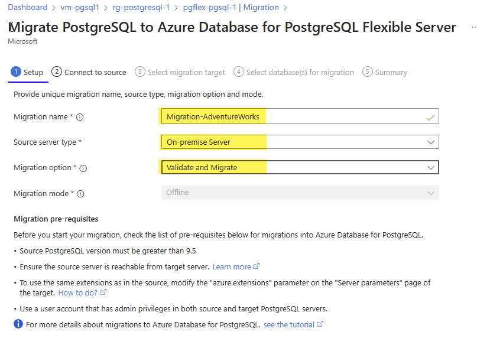
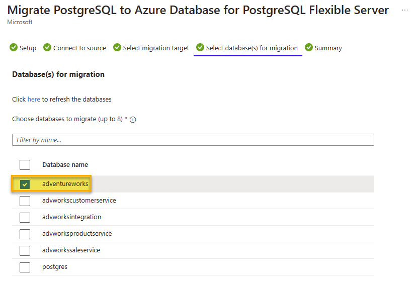

---
lab:
  title: 脱机 PostgreSQL 数据库迁移
  module: Migrate to Azure Database for PostgreSQL Flexible Server
---

# 脱机 PostgreSQL 数据库迁移

在本练习中，你将创建 Azure Database for PostgreSQL 灵活服务器，并使用 Azure Database for PostgreSQL 灵活服务器中的迁移功能从本地 PostgreSQL 服务器或 Azure Database for PostgreSQL 服务器执行脱机数据库迁移。

## 开始之前

需要有自己的 Azure 订阅才能完成本练习。 如果还没有 Azure 订阅，可以创建一个 [Azure 免费试用版](https://azure.microsoft.com/free)。

### 编辑 pg_hba.conf 文件以允许从 Azure 建立连接（如果不从外部 PostgreSQL 服务器迁移时则跳过）

> [!NOTE]
> 此实验室创建两个 Azure Database for PostgreSQL，用作迁移的源和目标。 但是，如果使用自己的环境来完成本练习，则需要访问具有数据库、适当权限和网络访问权限的现有 PostgreSQL 服务器。
> 
> 如果使用自己的环境，本练习将要求用作迁移源的服务器可供 Azure Database for PostgreSQL 灵活服务器访问，以便它可以连接和迁移数据库。 这要求源服务器可通过公共 IP 地址和端口进行访问。 可以从[ Azure IP 范围和服务标记 – 公有云](https://www.microsoft.com/en-gb/download/details.aspx?id=56519) 下载 Azure 区域 IP 地址列表，以帮助最大程度地减少防火墙规则中基于使用的 Azure 区域允许的 IP 地址范围。 打开服务器防火墙，允许 Azure Database for PostgreSQL 灵活服务器中的迁移功能访问源 PostgreSQL 服务器，默认为 TCP 端口 **5432**。
>
> 在源数据库的前面使用防火墙设备时，可能需要添加防火墙规则，以允许 Azure Database for PostgreSQL 灵活服务器中的迁移功能访问源数据库进行迁移。
>
> 用于迁移的 PostgreSQL 支持的最大版本是版本 16。

源 PostgreSQL 服务器需要更新 pg_hba.conf 文件，以确保实例允许从 Azure Database for PostgreSQL 灵活服务器进行连接。

1. 将条目添加到 pg_hba.conf，以允许来自 Azure IP 范围的连接。 pg_hba.conf 中的条目决定了哪些主机可以连接、哪些数据库、哪些用户以及可以使用哪些身份验证方法。
1. 例如，如果你的 Azure 服务位于 IP 范围 104.45.0.0/16 内。 若要允许所有用户使用密码身份验证从此范围连接到所有数据库，你需要添加：

``` bash
host    all    all    104.45.0.0/16    md5
```

1. 允许通过 Internet （包括来自 Azure）进行连接时，请确保已建立强大的身份验证机制

- 使用强密码。
- 限制访问的 IP 地址越少越好。
- 使用 VPN 或 VNet：如果可能，请配置虚拟专用网络(VPN)或 Azure 虚拟网络(VNet)，以便在 Azure 和 PostgreSQL 服务器之间提供安全隧道。

1. 将更改保存到 pg_hba.conf 后，必须在 psql 会话中使用 SQL 命令重新加载 PostgreSQL 配置更改才能生效：

```sql
SELECT pg_reload_conf();
```

1. 测试从 Azure 到本地 PostgreSQL 服务器的连接，以确保配置按预期工作。 可以从 Azure VM 或服务执行此操作，该服务支持出站数据库连接。

### 在你的 Azure 订阅上部署资源

此步骤指导你使用 Azure Cloud Shell 中的 Azure CLI 命令创建资源组并运行 Bicep 脚本，以将完成此练习所需的 Azure 服务部署到你的 Azure 订阅中。

1. 打开 web 浏览器，导航到 [Azure 门户](https://portal.azure.com/)。

1. 选择 Azure 门户工具栏中的“**Cloud Shell**”图标，以打开浏览器窗口底部的新“[Cloud Shell](https://learn.microsoft.com/azure/cloud-shell/overview)”窗格。

    

    如果出现提示，请选择打开 *Bash* shell 所需的选项。 如果以前使用过 *PowerShell* 控制台，请将其切换到 *Bash* shell。

1. 在 Cloud Shell 提示符下，输入以下内容以克隆包含练习资源的 GitHub 存储库：

    ```bash
    git clone https://github.com/MicrosoftLearning/mslearn-postgresql.git
    ```

1. 接下来，运行三个命令来定义变量，以在使用 Azure CLI 命令创建 Azure 资源时减少冗余键入。 变量表示要分配给资源组的名称（`RG_NAME`）、要将资源部署到的 Azure 区域（`REGION`）和随机生成的 PostgreSQL 管理员登录密码（`ADMIN_PASSWORD`）。

    在第一个命令中，分配给相应变量的区域是 `eastus`，但你也可以将其替换为首选位置。

    ```bash
    REGION=eastus
    ```

    以下命令分配要用于资源组的名称，该资源组将容纳本练习中使用的所有资源。 分配给相应变量的资源组名称是 `rg-learn-work-with-postgresql-$REGION`，其中 `$REGION` 是上文指定的位置。 但是，你可以将它更改为符合偏好的任何其他资源组名称。

    ```bash
    RG_NAME=rg-learn-work-with-postgresql-$REGION
    ```

    最后一个命令随机生成 PostgreSQL 管理员登录的密码。 请确保将其复制到安全位置，以便以后连接到 PostgreSQL 灵活服务器时使用。

    ```bash
    a=()
    for i in {a..z} {A..Z} {0..9}; 
       do
       a[$RANDOM]=$i
    done
    ADMIN_PASSWORD=$(IFS=; echo "${a[*]::18}")
    echo "Your randomly generated PostgreSQL admin user's password is:"
    echo $ADMIN_PASSWORD
    ```

1. 如果有权访问多个 Azure 订阅，并且默认订阅不是要为此练习创建资源组和其他资源的订阅，请运行此命令来设置相应的订阅，将 `<subscriptionName|subscriptionId>` 令牌替换为要使用的订阅的名称或 ID：

    ```azurecli
    az account set --subscription <subscriptionName|subscriptionId>
    ```

1. 运行以下 Azure CLI 命令创建资源组：

    ```azurecli
    az group create --name $RG_NAME --location $REGION
    ```

1. 最后，使用 Azure CLI 执行 Bicep 部署脚本，在资源组中预配 Azure 资源：

    ```azurecli
    az deployment group create --resource-group $RG_NAME --template-file "mslearn-postgresql/Allfiles/Labs/Shared/deploy-postgresql-server-migration.bicep" --parameters adminLogin=pgAdmin adminLoginPassword=$ADMIN_PASSWORD databaseName=adventureworks
    ```

    Bicep 部署脚本将完成此练习所需的 Azure 服务预配到你的资源组中。 部署的资源是两个 Azure Database for PostgreSQL 灵活服务器。 用于迁移的源服务器和目标服务器。

    部署通常需要几分钟才能完成（5-10 多分钟）。 你可以从 Cloud Shell 监视它，也可以导航到上述创建的资源组的“**部署**”页面，在那里观察部署进度。

1. 完成资源部署后，关闭 Cloud Shell 窗格。

1. 在Azure 门户，查看两个新的 Azure Database for PostgreSQL 服务器名称。 请注意，列出源服务器的数据库时，它包括 **adventureworks** 数据库，但目标数据库没有。

1. 在 *两台* 服务器的 **网络** 部分，
    1. 选择“**+ 添加当前 IP 地址(xxx.xxx.xxx)**”和“**保存**”。
    1. 选中“允许从 Azure 中的任何 Azure 服务公开访问此服务器”复选框。
    1. 选中“允许通过 Internet 使用公共 IP 地址公共访问此资源”复选框。****

> [!NOTE]
> 在生产环境中，只需选择想要访问 Azure Database for PostgreSQL 服务器的这些选项、网络和 IP。 

> [!NOTE]
> 如前所述，此 Bicep 脚本将创建两个 Azure Database for PostgreSQL 服务器，一个源和一个目标服务器。  ***如果在环境中使用本地 PostgreSQL 服务器作为此实验室的源服务器，请将以下所有说明中的源服务器连接信息替换为环境中的本地服务器的连接信息***。  请确保在环境和 Azure 中启用必要的防火墙规则。
    
### 排查部署错误

运行 Bicep 部署脚本时可能会遇到一些错误。 最常见的消息和解决它们的步骤包括：

- 如果你以前为此学习路径运行过 Bicep 部署脚本并随后删除了资源，如果在删除资源后 48 小时内尝试重新运行该脚本，可能会收到如下所示的错误消息：

    ```bash
    {"code": "InvalidTemplateDeployment", "message": "The template deployment 'deploy' is not valid according to the validation procedure. The tracking id is '4e87a33d-a0ac-4aec-88d8-177b04c1d752'. See inner errors for details."}
    
    Inner Errors:
    {"code": "FlagMustBeSetForRestore", "message": "An existing resource with ID '/subscriptions/{subscriptionId}/resourceGroups/rg-learn-postgresql-ai-eastus/providers/Microsoft.CognitiveServices/accounts/{accountName}' has been soft-deleted. To restore the resource, you must specify 'restore' to be 'true' in the property. If you don't want to restore existing resource, please purge it first."}
    ```

    如果收到此消息，请修改上述 `azure deployment group create` 命令，将 `restore` 参数设置为 `true`，然后重新运行。

- 如果所选区域受限于预配特定资源，则必须将 `REGION` 变量设置为其他位置，然后重新运行命令以创建资源组并运行 Bicep 部署脚本。

    ```bash
    {"status":"Failed","error":{"code":"DeploymentFailed","target":"/subscriptions/{subscriptionId}/resourceGroups/{resourceGrouName}/providers/Microsoft.Resources/deployments/{deploymentName}","message":"At least one resource deployment operation failed. Please list deployment operations for details. Please see https://aka.ms/arm-deployment-operations for usage details.","details":[{"code":"ResourceDeploymentFailure","target":"/subscriptions/{subscriptionId}/resourceGroups/{resourceGrouName}/providers/Microsoft.DBforPostgreSQL/flexibleServers/{serverName}","message":"The resource write operation failed to complete successfully, because it reached terminal provisioning state 'Failed'.","details":[{"code":"RegionIsOfferRestricted","message":"Subscriptions are restricted from provisioning in this region. Please choose a different region. For exceptions to this rule please open a support request with Issue type of 'Service and subscription limits'. See https://review.learn.microsoft.com/en-us/azure/postgresql/flexible-server/how-to-request-quota-increase for more details."}]}]}}
    ```

- 如果脚本由于接受负责任的 AI 协议的要求而无法创建 AI 资源，则可能会遇到以下错误：在这种情况下，使用 Azure 门户用户界面创建 Azure AI 服务资源，然后重新运行部署脚本。

    ```bash
    {"code": "InvalidTemplateDeployment", "message": "The template deployment 'deploy' is not valid according to the validation procedure. The tracking id is 'f8412edb-6386-4192-a22f-43557a51ea5f'. See inner errors for details."}
     
    Inner Errors:
    {"code": "ResourceKindRequireAcceptTerms", "message": "This subscription cannot create TextAnalytics until you agree to Responsible AI terms for this resource. You can agree to Responsible AI terms by creating a resource through the Azure Portal then trying again. For more detail go to https://go.microsoft.com/fwlink/?linkid=2164190"}
    ```

## 创建用于迁移的数据库、表和数据

此实验室提供从本地 PostreSQL 服务器或 Azure Database for PostgreSQL 服务器迁移的选项。 按照要从中迁移的服务器类型的说明进行操作。

### 在本地 PostgreSQL 服务器上创建数据库（如果从 Azure Database for PostgreSQL 服务器迁移，请跳过）

现在，我们需要设置要迁移到 Azure Database for PostgreSQL 灵活服务器的数据库。 此步骤需要在源 PostgreSQL 服务器实例上完成，该实例需要可供 Azure Database for PostgreSQL 灵活服务器访问才能完成此实验室。

首先，我们需要创建一个空数据库，我们将创建一个表，然后使用数据加载它。 首先，需要将 ***Lab10_setupTable.sql*** 和 ***Lab10_workorder.csv*** 文件从[存储库](https://github.com/MicrosoftLearning/mslearn-postgresql/tree/main/Allfiles/Labs/10)下载到本地驱动器（例如，**C:\\**）。
获得这些文件后，可以使用以下命令创建数据库， **根据 PostgreSQL 服务器的要求替换主机、端口和用户名的值。**

```bash
psql --host=localhost --port=5432 --username=pgadmin --command="CREATE DATABASE adventureworks;"
```

运行以下命令创建 `production.workorder` 表，以便加载数据：

```sql
    DROP SCHEMA IF EXISTS production CASCADE;
    CREATE SCHEMA production;
    
    DROP TABLE IF EXISTS production.workorder;
    CREATE TABLE production.workorder
    (
        workorderid integer NOT NULL,
        productid integer NOT NULL,
        orderqty integer NOT NULL,
        scrappedqty smallint NOT NULL,
        startdate timestamp without time zone NOT NULL,
        enddate timestamp without time zone,
        duedate timestamp without time zone NOT NULL,
        scrapreasonid smallint,
        modifieddate timestamp without time zone NOT NULL DEFAULT now()
    )
    WITH (
        OIDS = FALSE
    )
    TABLESPACE pg_default;
    ALTER TABLE production.workorder OWNER to pgAdmin;
```

```sql
psql --host=localhost --port=5432 --username=postgres --dbname=adventureworks --command="\COPY production.workorder FROM 'C:\Lab10_workorder.csv' CSV HEADER"
```

命令输出应为 `COPY 72101`，指示已将 72101 行从 CSV 文件写入表中。

## 预迁移（如果从 Azure Database for PostgreSQL 服务器迁移，请跳过）

在开始从源服务器脱机迁移数据库之前，我们需要确保目标服务器已配置并准备就绪。

1. 将用户和角色从源服务器迁移到新的灵活服务器。 这可以通过以下代码使用 pg_dumpall 工具来实现。
    1. Azure Database for PostgreSQL 不支持超级用户角色，因此任何具有这些特权的用户都应在迁移之前删除这些角色。

```bash
pg_dumpall --globals-only -U <<username>> -f <<filename>>.sql
```

1. 匹配目标服务器上的源服务器上的服务器参数值。
1. 禁用目标上的高可用性和读取副本。

### 在 Azure Database for PostgreSQL 服务器上创建数据库（如果从本地 PostgreSQL 服务器迁移，请跳过）

现在，我们需要设置要迁移到 Azure Database for PostgreSQL 灵活服务器的数据库。 此步骤需要在源 PostgreSQL 服务器实例上完成，该实例需要可供 Azure Database for PostgreSQL 灵活服务器访问才能完成此实验室。

首先，我们需要创建一个空数据库，我们将创建一个表，然后使用数据加载它。 

1. 在 [Azure 门户](https://portal.azure.com/)中，导航到新创建的源 Azure Database for PostgreSQL 服务器（_**psql-learn-source**_-location-uniquevalue）。

1. 在资源菜单的 **设置** 下，选择“ **数据库** ”为 `adventureworks` 数据库选择“ **连接**”。

    

1. 在 Cloud Shell 中的“用户 pgAdmin 密码”提示符下，输入随机生成的 **pgAdmin** 登录密码。

    登录后，将显示 `adventureworks` 数据库的 `psql` 提示。

1. 运行以下命令创建 `production.workorder` 表，以便加载数据：

    ```sql
        DROP SCHEMA IF EXISTS production CASCADE;
        CREATE SCHEMA production;
        
        DROP TABLE IF EXISTS production.workorder;
        CREATE TABLE production.workorder
        (
            workorderid integer NOT NULL,
            productid integer NOT NULL,
            orderqty integer NOT NULL,
            scrappedqty smallint NOT NULL,
            startdate timestamp without time zone NOT NULL,
            enddate timestamp without time zone,
            duedate timestamp without time zone NOT NULL,
            scrapreasonid smallint,
            modifieddate timestamp without time zone NOT NULL DEFAULT now()
        )
        WITH (
            OIDS = FALSE
        )
        TABLESPACE pg_default;
    ```

    ```sql
    \COPY production.workorder FROM 'mslearn-postgresql/Allfiles/Labs/10/Lab10_workorder.csv' CSV HEADER
    ```

    命令输出应为 `COPY 72101`，指示已将 72101 行从 CSV 文件写入表中。

1. 关闭 Cloud Shell。

## 在 Azure Database for PostgreSQL 灵活服务器中创建数据库迁移项目

1. 在目标服务器上，从灵活服务器边栏选项卡左侧的菜单中选择“ **迁移** ”。

   

1. 单击“**迁移**”边栏选项卡顶部的“**+ 创建**”选项。
   > **注意**：如果“**+ 创建**”选项不可用，请选择“**计算 + 存储**”并将计算层更改为“**常规用途**”或“**内存优化**”，并尝试再次创建迁移过程。 迁移成功后，可以将计算层更改回 **可突发**。
1. 在“**设置**”选项卡上，输入每个字段如下：
    1. 迁移名称 - **`Migration-AdventureWorks`**。
    1. 源服务器类型 - 对于此实验室，无论你是从本地迁移还是从 Azure Database for PostgreSQL 进行迁移，都选择 **本地服务器**。 在生产环境中，选择正确的源服务器类型。
    1. 迁移选项 - **验证和迁移**。
    1. 迁移模式 - **脱机**。 
    1. 选择“**下一步：选择运行时服务器>**”。
    1. 为*使用运行时服务器*选择**否**。
    1. 选择 **连接到源 >**。

    

1. 若要从 Azure Database for PostgreSQL- 在 “ **连接到源** ”选项卡上进行迁移，请输入每个字段，如下所示：
    1. 服务器名称 - 用作源的服务器地址。
    1. 端口 - PostgreSQL 实例在源服务器上使用的端口（默认值为 5432）。
    1. 服务器管理员登录名 - PostgreSQL 实例的管理员用户的名称（默认为 pgAdmin）。
    1. 密码 - 在上一步中指定的 PostgreSQL 管理员用户的密码。
    1. SSL 模式 - 首选。
    1. 单击“ **连接到源** ”选项以验证提供的连接详细信息。
    1. 单击“**下一步：选择迁移目标**”按钮进行。

1. 对于要迁移到的目标服务器，应自动完成连接详细信息。
    1. 在密码字段中 - 输入使用 bicep 脚本创建的 **pgAdmin** 登录名的随机生成密码。
    1. 单击“ **连接到目标** ”选项以验证提供的连接详细信息。
    1. 单击“**下一步：选择数据库进行迁移>**”按钮进行。
1. 在“ **选择要迁移的数据库** ”选项卡上，从要迁移到灵活服务器的源服务器中选择 **adventureworks** 。

    

1. 单击“**下一步：摘要>**”按钮进行并查看提供的数据。
1. 在“**摘要**”选项卡上，查看信息，然后单击“**开始验证和迁移**”按钮以开始迁移到灵活服务器。
1. 在“**迁移**”选项卡上，可以使用顶部菜单中的“**刷新**”按钮通过验证和迁移过程查看进度，从而监视迁移进度。
    1. 通过单击 **Migration-AdventureWorks** 活动，可以查看有关迁移活动进度的详细信息。
1. 迁移完成后，请检查目标服务器，现在应找到该服务器下也列出的 **adventureworks** 数据库。

迁移过程完成后，我们可以执行迁移后任务，例如新数据库中的数据验证和配置高可用性，然后再将应用程序指向数据库并再次打开。

## 练习清理

在本练习中部署的 Azure Database for PostgreSQL 将在下一个练习中使用。 这将产生费用，以便在本练习后停止服务器。 或者，可以删除 **rg-learn-work-with-postgresql-eastus** 资源组，以删除在本练习中部署的所有资源。 这意味着必须重复本练习中的步骤才能完成下一个练习。
