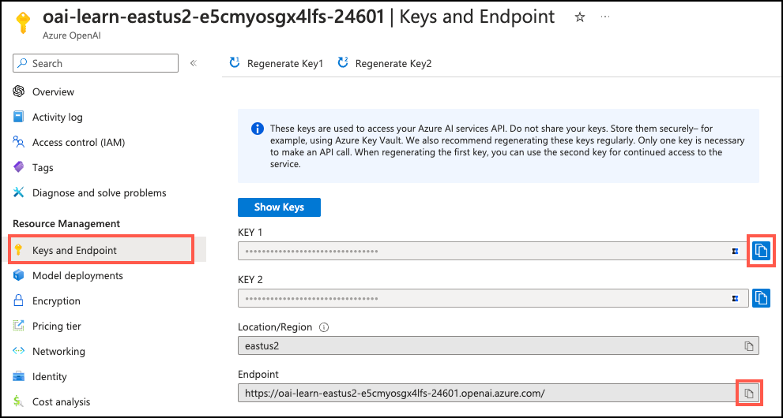

---
lab:
  title: 探索 Azure AI 扩展
  module: Explore Generative AI with Azure Database for PostgreSQL
---

# 探索 Azure AI 扩展

作为 Margie's Trave 的首席开发人员，你的任务是构建一个 AI 支持的应用程序，从而为客户提供有关租赁物业的智能建议。 你希望详细了解 Azure Database for PostgreSQL 的 `azure_ai` 扩展，以及它如何帮助你将生成式 AI (GenAI) 的强大功能集成到应用中。 在本练习中，你将通过在 Azure Database for PostgreSQL 灵活服务器数据库中安装 `azure_ai` 扩展并检查其集成 Azure AL 和 ML 服务的功能，从而探索该扩展及其功能。

## 开始之前

你需要一个具有管理权限的 [Azure 订阅](https://azure.microsoft.com/free)，并且必须在该订阅中获得 Azure OpenAI 访问许可。 如果需要 Azure OpenAI 访问权限，请在 [Azure OpenAI 受限访问](https://learn.microsoft.com/legal/cognitive-services/openai/limited-access)页进行申请。

### 在你的 Azure 订阅上部署资源

此步骤指导你使用 Azure Cloud Shell 中的 Azure CLI 命令创建资源组并运行 Bicep 脚本，以将完成此练习所需的 Azure 服务部署到你的 Azure 订阅中。

1. 打开 web 浏览器，导航到 [Azure 门户](https://portal.azure.com/)。

2. 选择 Azure 门户工具栏中的“ **Cloud Shell** ”图标，以打开浏览器窗口底部的新“ [Cloud Shell](https://learn.microsoft.com/azure/cloud-shell/overview) ”窗格。

    

    如果出现提示，请选择打开 *Bash* shell 所需的选项。 如果以前使用过 *PowerShell* 控制台，请将其切换到 *Bash* shell。

3. 在 Cloud Shell 提示符下，输入以下内容以克隆包含练习资源的 GitHub 存储库：

    ```bash
    git clone https://github.com/MicrosoftLearning/mslearn-postgresql.git
    ```

4. 接下来，运行三个命令来定义变量，以在使用 Azure CLI 命令创建 Azure 资源时减少冗余键入。 变量表示要分配给资源组的名称（`RG_NAME`）、要将资源部署到的 Azure 区域（`REGION`）和随机生成的 PostgreSQL 管理员登录密码（`ADMIN_PASSWORD`）。

    在第一个命令中，分配给相应变量的区域是 `eastus`，但你也可以将其替换为首选位置。 但是，如果替换默认值，则必须选择另一个 [支持抽象摘要的 Azure 区域](https://learn.microsoft.com/azure/ai-services/language-service/summarization/region-support) ，以确保可以完成此学习路径中模块中的所有任务。

    ```bash
    REGION=eastus
    ```

    以下命令分配要用于资源组的名称，该资源组将容纳本练习中使用的所有资源。 分配给相应变量的资源组名称是 `rg-learn-postgresql-ai-$REGION`，其中 `$REGION` 是上文指定的位置。 但是，你可以将它更改为符合偏好的任何其他资源组名称。

    ```bash
    RG_NAME=rg-learn-postgresql-ai-$REGION
    ```

    最后一个命令随机生成 PostgreSQL 管理员登录的密码。 将其复制到安全位置，以便稍后连接到 PostgreSQL 灵活服务器时使用。

    ```bash
    a=()
    for i in {a..z} {A..Z} {0..9}; 
        do
        a[$RANDOM]=$i
    done
    ADMIN_PASSWORD=$(IFS=; echo "${a[*]::18}")
    echo "Your randomly generated PostgreSQL admin user's password is:"
    echo $ADMIN_PASSWORD
    ```

5. 如果有权访问多个 Azure 订阅，并且默认订阅不是要为此练习创建资源组和其他资源的订阅，请运行此命令来设置相应的订阅，将 `<subscriptionName|subscriptionId>` 令牌替换为要使用的订阅的名称或 ID：

    ```azurecli
    az account set --subscription <subscriptionName|subscriptionId>
    ```

6. 运行以下 Azure CLI 命令创建资源组：

    ```azurecli
    az group create --name $RG_NAME --location $REGION
    ```

7. 最后，使用 Azure CLI 执行 Bicep 部署脚本，在资源组中预配 Azure 资源：

    ```azurecli
    az deployment group create --resource-group $RG_NAME --template-file "mslearn-postgresql/Allfiles/Labs/Shared/deploy.bicep" --parameters restore=false adminLogin=pgAdmin adminLoginPassword=$ADMIN_PASSWORD
    ```

    Bicep 部署脚本将完成此练习所需的 Azure 服务预配到你的资源组中。 部署的资源包括 Azure Database for PostgreSQL 灵活服务器、Azure OpenAI 和 Azure AI 语言服务。 Bicep 脚本还执行一些配置步骤，例如将 `azure_ai` 和 `vector` 扩展添加到 PostgreSQL 服务器的_允许列表_（通过 azure.extensions 服务器参数）、在服务器上创建名为 `rentals` 的数据库，以及使用 `text-embedding-ada-002` 模型将名为 `embedding` 的部署添加到 Azure OpenAI 服务。 请注意，Bicep 文件由此学习路径中的所有模块共享，因此在某些练习中只能使用某些已部署的资源。

    部署需要数分钟才能完成。 你可以从 Cloud Shell 监视它，也可以导航到上述创建的资源组的“**部署**”页面，在那里观察部署进度。

 8. 完成资源部署后，关闭 Cloud Shell 窗格。
 
### 排查部署错误

运行 Bicep 部署脚本时可能会遇到一些错误。

- 如果你以前为此学习路径运行过 Bicep 部署脚本并随后删除了资源，如果在删除资源后 48 小时内尝试重新运行该脚本，可能会收到如下所示的错误消息：

    ```bash
    {"code": "InvalidTemplateDeployment", "message": "The template deployment 'deploy' is not valid according to the validation procedure. The tracking id is '4e87a33d-a0ac-4aec-88d8-177b04c1d752'. See inner errors for details."}
    
    Inner Errors:
    {"code": "FlagMustBeSetForRestore", "message": "An existing resource with ID '/subscriptions/{subscriptionId}/resourceGroups/rg-learn-postgresql-ai-eastus/providers/Microsoft.CognitiveServices/accounts/{accountName}' has been soft-deleted. To restore the resource, you must specify 'restore' to be 'true' in the property. If you don't want to restore existing resource, please purge it first."}
    ```

    如果收到此消息，请修改上述 `azure deployment group create` 命令，将 `restore` 参数设置为 `true`，然后重新运行。

- 如果所选区域受限于预配特定资源，则必须将 `REGION` 变量设置为其他位置，然后重新运行命令以创建资源组并运行 Bicep 部署脚本。

    ```bash
    {"status":"Failed","error":{"code":"DeploymentFailed","target":"/subscriptions/{subscriptionId}/resourceGroups/{resourceGrouName}/providers/Microsoft.Resources/deployments/{deploymentName}","message":"At least one resource deployment operation failed. Please list deployment operations for details. Please see https://aka.ms/arm-deployment-operations for usage details.","details":[{"code":"ResourceDeploymentFailure","target":"/subscriptions/{subscriptionId}/resourceGroups/{resourceGrouName}/providers/Microsoft.DBforPostgreSQL/flexibleServers/{serverName}","message":"The resource write operation failed to complete successfully, because it reached terminal provisioning state 'Failed'.","details":[{"code":"RegionIsOfferRestricted","message":"Subscriptions are restricted from provisioning in this region. Please choose a different region. For exceptions to this rule please open a support request with Issue type of 'Service and subscription limits'. See https://review.learn.microsoft.com/en-us/azure/postgresql/flexible-server/how-to-request-quota-increase for more details."}]}]}}
    ```

- 如果脚本由于接受负责任的 AI 协议的要求而无法创建 AI 资源，则可能会遇到以下错误：在这种情况下，使用 Azure 门户用户界面创建 Azure AI 服务资源，然后重新运行部署脚本。

    ```bash
    {"code": "InvalidTemplateDeployment", "message": "The template deployment 'deploy' is not valid according to the validation procedure. The tracking id is 'f8412edb-6386-4192-a22f-43557a51ea5f'. See inner errors for details."}
     
    Inner Errors:
    {"code": "ResourceKindRequireAcceptTerms", "message": "This subscription cannot create TextAnalytics until you agree to Responsible AI terms for this resource. You can agree to Responsible AI terms by creating a resource through the Azure Portal then trying again. For more detail go to https://go.microsoft.com/fwlink/?linkid=2164190"}
    ```

## 在 Azure Cloud Shell 中使用 psql 连接到数据库

在此任务中，你将使用 [psql 命令行实用工具](https://www.postgresql.org/docs/current/app-psql.html)从 [Azure Cloud Shell](https://learn.microsoft.com/azure/cloud-shell/overview) 连接到 Azure Database for PostgreSQL 灵活服务器上的 `rentals` 数据库。

1. 在 [Azure 门户](https://portal.azure.com/)中，导航到新创建的 Azure Database for PostgreSQL 灵活服务器。

2. 在资源菜单中的“**设置**”下，选择“**数据库**”为 `rentals` 数据库选择“**连接**”。

    

3. 在 Cloud Shell 中的“用户 pgAdmin 密码”提示符下，输入随机生成的 **pgAdmin** 登录密码。

    登录后，将显示 `rentals` 数据库的 `psql` 提示。

4. 在本练习的其余部分中，可以继续在 Cloud Shell 中工作，因此选择窗格右上方的 **最大化** 按钮来展开浏览器窗口中的窗格可能会有所帮助。

    

## 在数据库中填充示例数据

在探索 `azure_ai` 扩展之前，请在 `rentals` 数据库中添加几个表，并在其中填入示例数据，这样你在查看扩展功能时就有了可用的信息。

1. 运行以下命令创建 `listings` 和 `reviews` 表，用于存储租赁属性列表和客户评审数据：

    ```sql
    DROP TABLE IF EXISTS listings;
    
    CREATE TABLE listings (
      id int,
      name varchar(100),
      description text,
      property_type varchar(25),
      room_type varchar(30),
      price numeric,
      weekly_price numeric
    );
    ```

    ```sql
    DROP TABLE IF EXISTS reviews;
    
    CREATE TABLE reviews (
      id int,
      listing_id int, 
      date date,
      comments text
    );
    ```

2. 接下来，使用 `COPY` 命令将数据从 CSV 文件加载到上面创建的每个表中。 执行以下命令以填充 `listings` 表：

    ```sql
    \COPY listings FROM 'mslearn-postgresql/Allfiles/Labs/Shared/listings.csv' CSV HEADER
    ```

    命令输出应为 `COPY 50`，指示从 CSV 文件写入表中的 50 行。

3. 最后，运行以下命令，将客户评论加载到 `reviews` 表中：

    ```sql
    \COPY reviews FROM 'mslearn-postgresql/Allfiles/Labs/Shared/reviews.csv' CSV HEADER
    ```

    命令输出应为 `COPY 354`，指示从 CSV 文件写入表中的 354 行。

## 安装和配置 `azure_ai` 扩展

在使用 `azure_ai` 扩展之前，必须先将其安装到数据库中，并将其配置为连接到 Azure AI 服务资源。 `azure_ai` 扩展让你能够将 Azure OpenAI 和 Azure AI 语言服务集成到数据库中。 要在数据库中启用该扩展，请执行以下步骤：

1. 在 `psql` 提示符处执行以下命令，验证设置环境时运行的 Bicep 部署脚本是否已成功将 `azure_ai` 扩展和 `vector` 扩展添加到服务器的“_允许列表中_”：

    ```sql
    SHOW azure.extensions;
    ```

    该命令显示服务器“_允许列表_”上的扩展列表。 如果所有内容都正确安装，则输出必须包含 `azure_ai` 和 `vector`，如下所示：

    ```sql
     azure.extensions 
    ------------------
     azure_ai,vector
    ```

    在 Azure Database for PostgreSQL 灵活服务器数据库中安装和使用扩展之前，必须将其添加到服务器的“_允许列表_”中，如[如何使用 PostgreSQL 扩展](https://learn.microsoft.com/azure/postgresql/flexible-server/concepts-extensions#how-to-use-postgresql-extensions)中所述。

2. 现在，你已准备好使用 [CREATE EXTENSION](https://www.postgresql.org/docs/current/sql-createextension.html) 命令安装 `azure_ai` 扩展。

    ```sql
    CREATE EXTENSION IF NOT EXISTS azure_ai;
    ```

    `CREATE EXTENSION` 通过运行其脚本文件将新扩展加载到数据库中。 此脚本通常会创建新的 SQL 对象，例如函数、数据类型和架构。 如果已存在同名的扩展，则会引发错误。 添加 `IF NOT EXISTS` 允许命令在已经安装的情况下执行，而不会引发错误。

## 检查 `azure_ai` 扩展中包含的对象

查看 `azure_ai` 扩展中包含的对象可以更好地了解其功能。 在此任务中，你将检查扩展添加到数据库中的各种架构、用户定义的函数 (UDFs) 和复合类型。

1. 在 Cloud Shell 中使用 `psql` 时，为查询结果启用扩展显示可能会有所帮助，因为它提高了后续命令输出的可读性。 执行以下命令以允许自动应用扩展显示。

    ```sql
    \x auto
    ```

2. [`\dx`元命令](https://www.postgresql.org/docs/current/app-psql.html#APP-PSQL-META-COMMAND-DX-LC)用于列出扩展中包含的对象。 从 `psql` 命令提示符运行以下命令，查看 `azure_ai` 扩展中的对象。 可能需要按空格键才能查看对象的完整列表。

    ```psql
    \dx+ azure_ai
    ```

    元命令输出显示 `azure_ai` 扩展创建了四个架构、多个用户定义函数 (UDF)、数据库中的多个复合类型和 `azure_ai.settings` 表。 除了架构之外，所有对象名称都以它们所属的架构开头。 架构用于对扩展添加到存储桶中的相关函数和类型进行分组。 下表列出了该扩展添加的架构，并简要描述了每个架构。

    | 架构      | 说明                                              |
    | ----------------- | ------------------------------------------------------------------------------------------------------ |
    | `azure_ai`    | 配置表和与扩展进行交互的 UDF 所在的主体架构。 |
    | `azure_openai`  | 包含实现调用 Azure OpenAI 终结点的 UDF。                    |
    | `azure_cognitive` | 提供与将数据库与 Azure AI 服务集成相关的 UDF 和复合类型。     |
    | `azure_ml`    | 包括用于集成 Azure 机器学习 (ML) 服务的 UDF。                |

### 探索 Azure AI 架构

该 `azure_ai` 架构提供用于直接从数据库与 Azure AI 和 ML 服务交互的框架。 它包含一些函数，用于设置与这些服务的连接，以及从同样托管在同一架构中的 `settings` 表中检索这些服务。 该 `settings` 表为与 Azure AI 和 ML 服务关联的终结点和密钥在数据库中提供安全存储。

1. 要查看架构中定义的函数，可以使用[`\df`元命令](https://www.postgresql.org/docs/current/app-psql.html#APP-PSQL-META-COMMAND-DF-LC)，指定应显示其函数的架构。 运行以下命令以查看 `azure_ai` 架构中的函数：

    ```sql
    \df azure_ai.*
    ```

    命令输出应类似于以下表格：

    ```sql
                  List of functions
     Schema |  Name  | Result data type | Argument data types | Type 
    ----------+-------------+------------------+----------------------+------
     azure_ai | get_setting | text      | key text      | func
     azure_ai | set_setting | void      | key text, value text | func
     azure_ai | version  | text      |           | func
    ```

    该 `set_setting()` 函数允许你设置 Azure AI 和 ML 服务的终结点和密钥，以便扩展可以连接到它们。 它接受一个**密钥**和分配给它的**值**。 `azure_ai.get_setting()` 函数提供了一种方法来检索你使用 `set_setting()` 函数设置的值。 它接受要查看的设置的**键**，并返回分配给它的值。 对于这两种方法，密钥必须是下列项之一：

    | 键 | 说明 |
    | --- | ----------- |
    | `azure_openai.endpoint` | 支持的 OpenAI 终结点（例如 <https://example.openai.azure.com>）。 |
    | `azure_openai.subscription_key` | Azure OpenAI 资源的订阅密钥。 |
    | `azure_cognitive.endpoint` | 支持的 Azure AI 服务终结点（例如 <https://example.cognitiveservices.azure.com>）。 |
    | `azure_cognitive.subscription_key` | Azure AI 服务资源的订阅密钥。 |
    | `azure_ml.scoring_endpoint` | 支持的 Azure ML 评分终结点（例如 <https://example.eastus2.inference.ml.azure.com/score>） |
    | `azure_ml.endpoint_key` | Azure ML 部署的终结点密钥。 |

    > 重要
    >
    > 由于 Azure AI 服务的连接信息（包括 API 密钥）存储在数据库的配置表中，因此 `azure_ai` 扩展定义了一个名为 `azure_ai_settings_manager` 的角色，以确保此信息受到保护，并且仅供分配了该角色的用户访问。 此角色允许读取和写入与扩展相关的设置。 只有 `azure_ai_settings_manager` 角色的成员才可以调用 `azure_ai.get_setting()` 和 `azure_ai.set_setting()` 函数。 在 Azure Database for PostgreSQL 灵活服务器中，所有管理员用户（分配了 `azure_pg_admin` 角色的用户）也分配了 `azure_ai_settings_manager` 角色。

2. 若要演示如何使用 `azure_ai.set_setting()` 和 `azure_ai.get_setting()` 函数，请配置与 Azure OpenAI 帐户的连接。 使用打开 Cloud Shell 的同一浏览器选项卡，最小化或还原 Cloud Shell 窗格，然后在 [Azure 门户](https://portal.azure.com/)中导航到 Azure OpenAI 资源。 进入 Azure OpenAI 资源页后，在资源菜单中的“**资源管理**”部分下，选择“**密钥和终结点**”，然后复制终结点和其中一个可用密钥。

    

    可以使用 `KEY 1` 或 `KEY 2`。 始终准备好两个密钥可以安全地轮换和重新生成密钥，而不会导致服务中断。

3. 获得终结点和密钥后，再次最大化 Cloud Shell 窗格，然后使用以下命令将值添加到配置表。 确保将 `{endpoint}` 和 `{api-key}` 令牌替换为从 Azure 门户复制的值。

    ```sql
    SELECT azure_ai.set_setting('azure_openai.endpoint', '{endpoint}');
    ```

    ```sql
    SELECT azure_ai.set_setting('azure_openai.subscription_key', '{api-key}');
    ```

4. 可以使用以下查询中的 `azure_ai.get_setting()` 函数验证写入 `azure_ai.settings` 表中的设置：

    ```sql
    SELECT azure_ai.get_setting('azure_openai.endpoint');
    SELECT azure_ai.get_setting('azure_openai.subscription_key');
    ```

    `azure_ai` 扩展现已连接到你的 Azure OpenAI 帐户。

### 查看 Azure OpenAI 架构

`azure_openai` 架构提供了使用 Azure OpenAI 将文本值的矢量嵌入创建集成到数据库中的功能。 通过使用此架构，可以直接从数据库[使用 Azure OpenAI 生成嵌入](https://learn.microsoft.com/azure/ai-services/openai/how-to/embeddings)，以创建输入文本的矢量表示形式，然后可将其用于矢量相似性搜索，并由机器学习模型使用。 该架构包含一个函数 `create_embeddings()`，其中有两个重载。 一个重载接受单个输入字符串，另一个重载要求输入字符串数组。

1. 如上所述，可以使用 [`\df` 元命令](https://www.postgresql.org/docs/current/app-psql.html#APP-PSQL-META-COMMAND-DF-LC)查看 `azure_openai` 架构中函数的详细信息：

    ```sql
    \df azure_openai.*
    ```

    输出显示了 `azure_openai.create_embeddings()` 函数的两个重载，让你可以查看函数的两个版本及其返回的类型之间的差异。 输出中的 `Argument data types` 属性显示了两个函数重载所需的参数列表：

    | 参数    | 类型       | 默认 | 说明                                                          |
    | --------------- | ------------------ | ------- | ------------------------------------------------------------------------------------------------------------------------------ |
    | deployment_name | `text`      |    | Azure OpenAI Studio 中包含 `text-embedding-ada-002` 模型的部署名称。               |
    | input     | `text` 或 `text[]` |    | 为其创建嵌入的输入文本（或文本数组）。                                |
    | batch_size   | `integer`     | 100  | 仅适用于期望输入 `text[]` 的重载。 指定一次要处理的记录数。          |
    | timeout_ms   | `integer`     | 3600000 | 超时的毫秒数，超过该时间后操作将停止。                                 |
    | throw_on_error | `boolean`     | 是  | 指示函数是否应在出错时引发异常，从而导致包装事务回滚的标志。 |
    | max_attempts  | `integer`     | 1   | 在发生故障时重新调用 Azure OpenAI 服务的尝试次数。                     |
    | retry_delay_ms | `integer`     | 1000  | 尝试重新调用 Azure OpenAI 服务终结点之前等待的时间（以毫秒为单位）。        |

2. 若要提供使用该函数的简化示例，请运行以下查询，为 `listings` 表中的 `description` 字段创建一个矢量嵌入。 函数中的 `deployment_name` 参数设置为 `embedding`，即 Azure OpenAI 服务中 `text-embedding-ada-002` 模型的部署名称（它是由 Bicep 部署脚本使用该名称创建的）：

    ```sql
    SELECT
      id,
      name,
      azure_openai.create_embeddings('embedding', description) AS vector
    FROM listings
    LIMIT 1;
    ```

    输出与下面类似：

    ```sql
     id |      name       |              vector
    ----+-------------------------------+------------------------------------------------------------
      1 | Stylish One-Bedroom Apartment | {0.020068742,0.00022734122,0.0018286322,-0.0064167166,...}
    ```

    为简洁起见，矢量嵌入在上述输出中缩写。

    [嵌入](https://learn.microsoft.com/azure/postgresql/flexible-server/generative-ai-overview#embeddings)是机器学习和自然语言处理 (NLP) 中的一个概念，涉及将单词、文档或实体等对象表示为多维空间中的[矢量](https://learn.microsoft.com/azure/postgresql/flexible-server/generative-ai-overview#vectors)。 嵌入允许机器学习模型评估两个信息之间的密切程度。 此技术可有效识别数据之间的关系和相似性，使算法能够识别模式并做出准确预测。

    `azure_ai` 扩展让你可以为输入文本生成嵌入。 要使生成的矢量与数据库中的其余数据一起存储，必须按照[在数据库中启用矢量支持](https://learn.microsoft.com/azure/postgresql/flexible-server/how-to-use-pgvector#enable-extension)文档中的指南安装 `vector` 扩展。 但是，这超出了本练习的范围。

### 检查azure_cognitive架构

该 `azure_cognitive` 架构提供用于直接从数据库与 Azure AI 服务交互的框架。 架构中包含的 Azure AI 服务集成提供了一套丰富的 AI 语言功能，可直接从数据库访问。 这些功能包括情绪分析、语言检测、关键短语提取、实体识别，文本汇总和翻译。 可通过 [Azure AI 语言服务](https://learn.microsoft.com/azure/ai-services/language-service/overview)启用这些功能。

1. 若要查看架构中定义的所有函数，可以像以前一样使用[`\df`元命令](https://www.postgresql.org/docs/current/app-psql.html#APP-PSQL-META-COMMAND-DF-LC)。 若要查看 `azure_cognitive` 架构中的函数，请运行：

    ```sql
    \df azure_cognitive.*
    ```

2. 此架构中定义了许多函数，因此 [`\df` 元命令](https://www.postgresql.org/docs/current/app-psql.html#APP-PSQL-META-COMMAND-DF-LC)的输出可能难以读取，因此最好将其拆分为较小的区块。 运行以下命令来仅查看 `analyze_sentiment()` 函数：

    ```sql
    \df azure_cognitive.analyze_sentiment
    ```

    在输出中，观察函数有三个重载，一个重载接受单个输入字符串，另两个需要文本数组。 输出显示函数的架构、名称、结果数据类型和参数数据类型。 此信息可帮助你了解如何使用函数。

3. 重复上述命令，用以下每个函数名替换 `analyze_sentiment` 函数名，以检查架构中的所有可用函数：

   - `detect_language`
   - `extract_key_phrases`
   - `linked_entities`
   - `recognize_entities`
   - `recognize_pii_entities`
   - `summarize_abstractive`
   - `summarize_extractive`
   - `translate`

    对于每个函数，检查函数的各种形式及其预期输入和生成的数据类型。

4. 除了函数， `azure_cognitive` 架构还包含多个复合类型，这些类型用作各种函数的返回数据类型。 必须了解函数返回的数据类型的结构，以便正确处理查询中的输出。 例如，运行以下命令检查 `sentiment_analysis_result` 类型：

    ```sql
    \dT+ azure_cognitive.sentiment_analysis_result
    ```

5. 上述命令的输出显示 `sentiment_analysis_result` 类型是 `tuple`。 可以通过运行以下命令来查看 `sentiment_analysis_result` 类型中包含的列，从而进一步了解 `tuple` 的结构：

    ```sql
    \d+ azure_cognitive.sentiment_analysis_result
    ```

    该命令的输出应如下所示：

    ```sql
             Composite type "azure_cognitive.sentiment_analysis_result"
       Column  |   Type   | Collation | Nullable | Default | Storage | Description 
    ----------------+------------------+-----------+----------+---------+----------+-------------
     sentiment   | text      |     |     |    | extended | 
     positive_score | double precision |     |     |    | plain  | 
     neutral_score | double precision |     |     |    | plain  | 
     negative_score | double precision |     |     |    | plain  |
    ```

    `azure_cognitive.sentiment_analysis_result` 是一个复合类型，包含输入文本的情绪预测。 它包括情绪（可以是积极、消极、中立或混合）以及文本中发现的积极、中立和消极方面的分数。 分数表示为介于 0 和 1 之间的实数。 例如，在（中性，0.26、0.64、0.09）中，情绪是中性的，其中正面分数为 0.26，中性为 0.64，负面分数 为0.09。

6. 与 `azure_openai` 函数一样，要使用 `azure_ai` 扩展成功调用 Azure AI 服务，必须提供 Azure AI 语言服务的终结点和密钥。 使用打开 Cloud Shell 的同一浏览器选项卡，最小化或还原 Cloud Shell 窗格，然后在 [Azure 门户](https://portal.azure.com/)中导航到语言服务资源。 在资源菜单的**资源管理**部分中，选择“**键和终结点**”。

    

7. 复制终结点并访问密钥值，并将 `{endpoint}` 和 `{api-key}` 令牌替换为从 Azure 门户复制的值。 再次最大化 Cloud Shell，并在 Cloud Shell 的 `psql` 命令提示符下运行命令，将值添加到配置表中。

    ```sql
    SELECT azure_ai.set_setting('azure_cognitive.endpoint', '{endpoint}');
    ```

    ```sql
    SELECT azure_ai.set_setting('azure_cognitive.subscription_key', '{api-key}');
    ```

8. 现在，执行以下查询来分析几个评论的情绪：

    ```sql
    SELECT
      id,
      comments,
      azure_cognitive.analyze_sentiment(comments, 'en') AS sentiment
    FROM reviews
    WHERE id IN (1, 3);
    ```

    观察输出中的 `sentiment` 值、`(mixed,0.71,0.09,0.2)` 和 `(positive,0.99,0.01,0)`。 这些代表上述查询中 `sentiment_analysis_result` 函数返回的 `analyze_sentiment()`。 分析是在 `reviews` 表中的 `comments` 字段上执行的。

## 检查 Azure ML 架构

该 `azure_ml` 架构允许函数直接从数据库连接到 Azure ML 服务。

1. 若要查看架构中定义的函数，可以使用[`\df`元命令](https://www.postgresql.org/docs/current/app-psql.html#APP-PSQL-META-COMMAND-DF-LC)。 若要查看架构中的 `azure_ml` 函数，请运行：

    ```sql
    \df azure_ml.*
    ```

    在输出中，观察此架构中定义了两个函数，即 `azure_ml.inference()` 和 `azure_ml.invoke()`，其详细信息如下所示：

    ```sql
                  List of functions
    -----------------------------------------------------------------------------------------------------------
    Schema       | azure_ml
    Name        | inference
    Result data type  | jsonb
    Argument data types | input_data jsonb, deployment_name text DEFAULT NULL::text, timeout_ms integer DEFAULT NULL::integer, throw_on_error boolean DEFAULT true, max_attempts integer DEFAULT 1, retry_delay_ms integer DEFAULT 1000
    Type        | func
    ```

    `inference()` 函数使用训练有素的机器学习模型，根据未见过的新数据预测或生成输出。

    通过提供终结点和密钥，可以连接到 Azure ML 部署的终结点，例如连接到 Azure OpenAI 和 Azure AI 服务终结点。 与 Azure ML 交互需要有一个经过训练和部署的模型，因此不在本练习的范围内，你也不会在这里设置连接来进行尝试。

## 清理

完成本练习后，请删除创建的 Azure 资源。 你需要为配置的容量（而不是数据库的使用量）付费。 按照这些说明删除资源组和为此实验室创建的所有资源。

1. 打开 Web 浏览器并导航到 [Azure 门户](https://portal.azure.com/)，然后在主页上选择 Azure 服务下的**资源组**。

    

2. 在任何字段搜索框的筛选器中，输入为此实验室创建的资源组的名称，然后从列表中选择你的资源组。

3. 在资源组的“概述”页面中，选择“删除资源组” 。

    

4. 在确认对话框中，输入要删除的资源组名称进行确认，然后选择“**删除**”。
