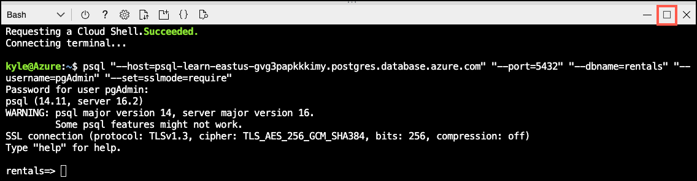

---
lab:
  title: 使用 Azure OpenAI 生成矢量嵌入
  module: Enable Semantic Search with Azure Database for PostgreSQL
---

# 使用 Azure OpenAI 生成矢量嵌入

若要执行语义搜索，必须先从模型生成嵌入向量，将其存储在向量数据库中，然后查询嵌入内容。 你将创建一个数据库，使用示例数据填充该数据库，并针对这些列表运行语义搜索。

在本练习结束时，你将有一个启用了 `vector` 和 `azure_ai` 扩展的 Azure Database for PostgreSQL 灵活服务器实例。 你将为 [Seattle Airbnb Open Data](https://www.kaggle.com/datasets/airbnb/seattle?select=listings.csv) 数据集的 `listings` 表生成嵌入内容。 你还将通过生成查询的嵌入向量和执行向量余弦距离搜索来对这些列表运行语义搜索。

## 开始之前

你需要具有管理权限的 [Azure 订阅](https://azure.microsoft.com/free)。

### 在你的 Azure 订阅上部署资源

此步骤指导你使用 Azure Cloud Shell 中的 Azure CLI 命令创建资源组并运行 Bicep 脚本，以将完成此练习所需的 Azure 服务部署到你的 Azure 订阅中。

> **注意**：如果要在此学习路径中执行多个模块，则可以在它们之间共享 Azure 环境。 在这种情况下，你只需完成此资源部署步骤一次。

1. 打开 web 浏览器，导航到 [Azure 门户](https://portal.azure.com/)。

2. 选择 Azure 门户工具栏中的“ **Cloud Shell** ”图标，以打开浏览器窗口底部的新“ [Cloud Shell](https://learn.microsoft.com/azure/cloud-shell/overview) ”窗格。

    

    如果出现提示，请选择打开 *Bash* shell 所需的选项。 如果以前使用过 *PowerShell* 控制台，请将其切换到 *Bash* shell。

3. 在 Cloud Shell 提示符下，输入以下内容以克隆包含练习资源的 GitHub 存储库：

    ```bash
    git clone https://github.com/MicrosoftLearning/mslearn-postgresql.git
    ```

4. 接下来，运行三个命令来定义变量，以在使用 Azure CLI 命令创建 Azure 资源时减少冗余键入。 变量表示要分配给资源组的名称（`RG_NAME`）、要将资源部署到的 Azure 区域（`REGION`）和随机生成的 PostgreSQL 管理员登录密码（`ADMIN_PASSWORD`）。

    在第一个命令中，分配给相应变量的区域是 `eastus`，但你也可以将其替换为首选位置。 但是，如果替换默认值，则必须选择另一个 [支持抽象摘要的 Azure 区域](https://learn.microsoft.com/azure/ai-services/language-service/summarization/region-support) ，以确保可以完成此学习路径中模块中的所有任务。

    ```bash
    REGION=eastus
    ```

    以下命令分配要用于资源组的名称，该资源组将容纳本练习中使用的所有资源。 分配给相应变量的资源组名称是 `rg-learn-postgresql-ai-$REGION`，其中 `$REGION` 是先前指定的位置。 但是，你可以将它更改为符合偏好的任何其他资源组名称。

    ```bash
    RG_NAME=rg-learn-postgresql-ai-$REGION
    ```

    最后一个命令随机生成 PostgreSQL 管理员登录的密码。 **请确保将其复制** 到安全位置，以便稍后连接到 PostgreSQL 灵活服务器。

    ```bash
    a=()
    for i in {a..z} {A..Z} {0..9}; 
        do
        a[$RANDOM]=$i
        done
    ADMIN_PASSWORD=$(IFS=; echo "${a[*]::18}")
    echo "Your randomly generated PostgreSQL admin user's password is:"
    echo $ADMIN_PASSWORD
    ```

5. 如果有权访问多个 Azure 订阅，而默认订阅不是要在其中为此练习创建资源组和其他资源的订阅，请运行此命令来设置相应的订阅，将 `<subscriptionName|subscriptionId>` 令牌替换为要使用的订阅的名称或 ID：

    ```azurecli
    az account set --subscription <subscriptionName|subscriptionId>
    ```

6. 运行以下 Azure CLI 命令创建资源组：

    ```azurecli
    az group create --name $RG_NAME --location $REGION
    ```

7. 最后，使用 Azure CLI 执行 Bicep 部署脚本，在资源组中预配 Azure 资源：

    ```azurecli
    az deployment group create --resource-group $RG_NAME --template-file "mslearn-postgresql/Allfiles/Labs/Shared/deploy.bicep" --parameters restore=false adminLogin=pgAdmin adminLoginPassword=$ADMIN_PASSWORD
    ```

    Bicep 部署脚本将完成此练习所需的 Azure 服务预配到你的资源组中。 部署的资源包括 Azure Database for PostgreSQL 灵活服务器、Azure OpenAI 和 Azure AI 语言服务。 Bicep 脚本还执行一些配置步骤，例如将 `azure_ai` 和 `vector` 扩展添加到 PostgreSQL 服务器的_允许列表_中（通过 `azure.extensions` 服务器参数），在服务器上创建名为 `rentals` 的数据库，并使用 `text-embedding-ada-002` 模型将名为 `embedding` 的部署添加到你的 Azure OpenAI 服务中。 请注意，Bicep 文件由此学习路径中的所有模块共享，因此在某些练习中只能使用某些已部署的资源。

    部署需要数分钟才能完成。 你可以从 Cloud Shell 监视它，也可以导航到先前创建的资源组的“**部署**”页，在那里观察部署进度。

8. 完成资源部署后，关闭 Cloud Shell 窗格。
 
### 排查部署错误

运行 Bicep 部署脚本时可能会遇到一些错误。

- 如果你以前为此学习路径运行过 Bicep 部署脚本并随后删除了资源，如果在删除资源后 48 小时内尝试重新运行该脚本，可能会收到如下所示的错误消息：

    ```bash
    {"code": "InvalidTemplateDeployment", "message": "The template deployment 'deploy' is not valid according to the validation procedure. The tracking id is '4e87a33d-a0ac-4aec-88d8-177b04c1d752'. See inner errors for details."}
    
    Inner Errors:
    {"code": "FlagMustBeSetForRestore", "message": "An existing resource with ID '/subscriptions/{subscriptionId}/resourceGroups/rg-learn-postgresql-ai-eastus/providers/Microsoft.CognitiveServices/accounts/{accountName}' has been soft-deleted. To restore the resource, you must specify 'restore' to be 'true' in the property. If you don't want to restore existing resource, please purge it first."}
    ```

    如果收到此消息，请修改上述 `azure deployment group create` 命令，将 `restore` 参数设置为 `true`，然后重新运行。

- 如果所选区域受限于预配特定资源，则必须将 `REGION` 变量设置为其他位置，然后重新运行命令以创建资源组并运行 Bicep 部署脚本。

    ```bash
    {"status":"Failed","error":{"code":"DeploymentFailed","target":"/subscriptions/{subscriptionId}/resourceGroups/{resourceGrouName}/providers/Microsoft.Resources/deployments/{deploymentName}","message":"At least one resource deployment operation failed. Please list deployment operations for details. Please see https://aka.ms/arm-deployment-operations for usage details.","details":[{"code":"ResourceDeploymentFailure","target":"/subscriptions/{subscriptionId}/resourceGroups/{resourceGrouName}/providers/Microsoft.DBforPostgreSQL/flexibleServers/{serverName}","message":"The resource write operation failed to complete successfully, because it reached terminal provisioning state 'Failed'.","details":[{"code":"RegionIsOfferRestricted","message":"Subscriptions are restricted from provisioning in this region. Please choose a different region. For exceptions to this rule please open a support request with Issue type of 'Service and subscription limits'. See https://review.learn.microsoft.com/en-us/azure/postgresql/flexible-server/how-to-request-quota-increase for more details."}]}]}}
    ```

- 如果脚本由于必须接受负责任的 AI 协议而无法创建 AI 资源，则可能会遇到以下错误：在这种情况下，使用 Azure 门户用户界面创建 Azure AI 服务资源，然后重新运行部署脚本。

    ```bash
    {"code": "InvalidTemplateDeployment", "message": "The template deployment 'deploy' is not valid according to the validation procedure. The tracking id is 'f8412edb-6386-4192-a22f-43557a51ea5f'. See inner errors for details."}
     
    Inner Errors:
    {"code": "ResourceKindRequireAcceptTerms", "message": "This subscription cannot create TextAnalytics until you agree to Responsible AI terms for this resource. You can agree to Responsible AI terms by creating a resource through the Azure Portal then trying again. For more detail go to https://go.microsoft.com/fwlink/?linkid=2164190"}
    ```

## 在 Azure Cloud Shell 中使用 psql 连接到数据库

在此任务中，你将使用 [psql 命令行实用工具](https://www.postgresql.org/docs/current/app-psql.html)从 [Azure Cloud Shell](https://learn.microsoft.com/azure/cloud-shell/overview) 连接到 Azure Database for PostgreSQL 服务器上的 `rentals` 数据库。

1. 在 [Azure 门户](https://portal.azure.com/)中，导航到新创建的 Azure Database for PostgreSQL 灵活服务器。

2. 在资源菜单中的“**设置**”下，选择“**数据库**”为 `rentals` 数据库选择“**连接**”。 请注意，选择“**连接**”并不会直接连接到数据库，而是提供了多种连接数据库的说明。 查看“**从浏览器或本地连接**”中的说明，并按照这些说明通过 Azure Cloud Shell 建立连接。

    

3. 在 Cloud Shell 中的“用户 pgAdmin 密码”提示符处，输入随机生成的 **pgAdmin** 登录密码。

    登录后，将显示 `rentals` 数据库的 `psql` 提示。

4. 在本练习的其余部分中，可以继续在 Cloud Shell 中工作，因此选择窗格右上方的“**最大化**”按钮来展开浏览器窗口中的窗格可能会有所帮助。

    

## 安装：配置扩展

若要存储和查询向量以及生成嵌入内容，需要允许列表并为 Azure Database for PostgreSQL 灵活服务器启用两个扩展：`vector` 和 `azure_ai`。

1. 若要同时列出扩展，请按照 [如何使用 PostgreSQL 扩展](https://learn.microsoft.com/en-us/azure/postgresql/flexible-server/concepts-extensions#how-to-use-postgresql-extensions) 中提供的说明，在服务器参数 `azure.extensions` 中添加 `vector` 和 `azure_ai`。

2. 运行以下 SQL 命令启用 `vector` 扩展。 有关详细说明，请阅读[如何在 Azure Database for PostgreSQL 灵活服务器上启用和使用 `pgvector`](https://learn.microsoft.com/en-us/azure/postgresql/flexible-server/how-to-use-pgvector#enable-extension)。

    ```sql
    CREATE EXTENSION vector;
    ```

3. 要启用 `azure_ai` 扩展，请运行以下 SQL 命令。 你需要 Azure OpenAI 资源的终结点和 API 密钥。 有关详细说明，请阅读[启用 `azure_ai` 扩展](https://learn.microsoft.com/en-us/azure/postgresql/flexible-server/generative-ai-azure-overview#enable-the-azure_ai-extension)。

    ```sql
    CREATE EXTENSION azure_ai;
    SELECT azure_ai.set_setting('azure_openai.endpoint', 'https://<endpoint>.openai.azure.com');
    SELECT azure_ai.set_setting('azure_openai.subscription_key', '<API Key>');
    ```

## 在数据库中填充示例数据

在探索 `azure_ai` 扩展之前，请在 `rentals` 数据库中添加几个表，并在其中填入示例数据，这样你在查看扩展功能时就有了可用的信息。

1. 运行以下命令创建 `listings` 和 `reviews` 表，用于存储租赁属性列表和客户评审数据：

    ```sql
    DROP TABLE IF EXISTS listings;
    
    CREATE TABLE listings (
        id int,
        name varchar(100),
        description text,
        property_type varchar(25),
        room_type varchar(30),
        price numeric,
        weekly_price numeric
    );
    ```

    ```sql
    DROP TABLE IF EXISTS reviews;
    
    CREATE TABLE reviews (
        id int,
        listing_id int, 
        date date,
        comments text
    );
    ```

2. 接下来，使用 `COPY` 命令将数据从 CSV 文件加载到上面创建的每个表中。 执行以下命令以填充 `listings` 表：

    ```sql
    \COPY listings FROM 'mslearn-postgresql/Allfiles/Labs/Shared/listings.csv' CSV HEADER
    ```

    命令输出应为 `COPY 50`，指示从 CSV 文件写入表中的 50 行。

3. 最后，运行以下命令，将客户评论加载到 `reviews` 表中：

    ```sql
    \COPY reviews FROM 'mslearn-postgresql/Allfiles/Labs/Shared/reviews.csv' CSV HEADER
    ```

    命令输出应为 `COPY 354`，指示已从 CSV 文件写入表中 354 行。

若要重置示例数据，可以执行 `DROP TABLE listings`，并重复这些步骤。

## 创建和存储嵌入向量

现在我们有了一些示例数据，接下来可以生成和存储嵌入向量。 该 `azure_ai` 扩展使调用 Azure OpenAI 嵌入 API 变得简单。

1. 添加嵌入向量列。

    `text-embedding-ada-002` 模型配置为返回 1,536 个维度，因此请对向量列大小使用该维度。

    ```sql
    ALTER TABLE listings ADD COLUMN listing_vector vector(1536);
    ```

1. 通过 create_embeddings 用户定义的函数（由 azure_ai 扩展实现）调用 Azure OpenAI，为每个列表的说明生成嵌入向量：

    ```sql
    UPDATE listings
    SET listing_vector = azure_openai.create_embeddings('embedding', description, max_attempts => 5, retry_delay_ms => 500)
    WHERE listing_vector IS NULL;
    ```

    请注意，这可能需要几分钟时间，具体取决于可用配额。

1. 通过运行此查询查看示例向量：

    ```sql
    SELECT listing_vector FROM listings LIMIT 1;
    ```

    你将获得如下所示的结果，但具有 1536 向量列：

    ```sql
    postgres=> SELECT listing_vector FROM listings LIMIT 1;
    -[ RECORD 1 ]--+------ ...
    listing_vector | [-0.0018742813,-0.04530062,0.055145424, ... ]
    ```

## 执行语义搜索查询

现在，你的列表数据已经添加了嵌入向量，是时候运行语义搜索查询了。 为此，请获取查询字符串嵌入向量，然后执行余弦搜索，找出其描述与查询语义最相似的列表。

1. 生成查询字符串的嵌入。

    ```sql
    SELECT azure_openai.create_embeddings('embedding', 'bright natural light');
    ```

    可能会获得以下所示结果：

    ```sql
    -[ RECORD 1 ]-----+-- ...
    create_embeddings | {-0.0020871465,-0.002830255,0.030923981, ...}
    ```

1. 在余弦搜索中使用嵌入（`<=>` 表示余弦距离运算），获取与查询最相似的前 10 个列表。

    ```sql
    SELECT id, name FROM listings ORDER BY listing_vector <=> azure_openai.create_embeddings('embedding', 'bright natural light')::vector LIMIT 10;
    ```

    你会获得类似以下的结果： 由于无法保证嵌入向量的确定性，因此结果可能会有所不同：

    ```sql
        id    |                name                
    ----------+-------------------------------------
     6796336  | A duplex near U district!
     7635966  | Modern Capitol Hill Apartment
     7011200  | Bright 1 bd w deck. Great location
     8099917  | The Ravenna Apartment
     10211928 | Charming Ravenna Bungalow
     692671   | Sun Drenched Ballard Apartment
     7574864  | Modern Greenlake Getaway
     7807658  | Top Floor Corner Apt-Downtown View
     10265391 | Art filled, quiet, walkable Seattle
     5578943  | Madrona Studio w/Private Entrance
    ```

1. 还可以投影 `description` 列，以便阅读语义上描述相似的匹配行的文本。 例如，此查询返回最佳匹配项：

    ```sql
    SELECT id, description FROM listings ORDER BY listing_vector <=> azure_openai.create_embeddings('embedding', 'bright natural light')::vector LIMIT 1;
    ```

    输出如下内容：

    ```sql
       id    | description
    ---------+------------
     6796336 | This is a great place to live for summer because you get a lot of sunlight at the living room. A huge living room space with comfy couch and one ceiling window and glass windows around the living room.
    ```

为了直观地理解语义搜索，请注意说明实际上不包含术语“明亮”或“自然”。 但它确实突出了“夏季”和“阳光”、“窗户”和“天花板窗口”。

## 检查你的工作

执行上述步骤后，`listings` 表中包含来自 Kaggle 上的 [Seattle Airbnb Open Data](https://www.kaggle.com/datasets/airbnb/seattle/data?select=listings.csv) 的样本数据。 列表通过嵌入矢量进行扩充，以执行语义搜索。

1. 确认列表表有四列： `id`、 `name`、 `description`和 `listing_vector`。

    ```sql
    \d listings
    ```

    打印的内容应该类似于：

    ```sql
                            Table "public.listings"
          Column    |         Type           | Collation | Nullable | Default 
    ----------------+------------------------+-----------+----------+---------
      id            | integer                |           | not null | 
      name          | character varying(255) |           | not null | 
      description   | text                   |           | not null | 
     listing_vector | vector(1536)           |           |          | 
     Indexes:
        "listings_pkey" PRIMARY KEY, btree (id)
    ```

1. 确认至少有一行已填充 listing_vector 列。

    ```sql
    SELECT COUNT(*) > 0 FROM listings WHERE listing_vector IS NOT NULL;
    ```

    结果必须显示 `t`，即 true。 指示至少有一行包含相应说明列的嵌入值：

    ```sql
    ?column? 
    ----------
    t
    (1 row)
    ```

    确认嵌入矢量具有 1536 个维度：

    ```sql
    SELECT vector_dims(listing_vector) FROM listings WHERE listing_vector IS NOT NULL LIMIT 1;
    ```

    生成：

    ```sql
    vector_dims 
    -------------
            1536
    (1 row)
    ```

1. 确认语义搜索返回结果。

    在余弦搜索中使用嵌入，提取与查询最相似的前 10 个列表。

    ```sql
    SELECT id, name FROM listings ORDER BY listing_vector <=> azure_openai.create_embeddings('embedding', 'bright natural light')::vector LIMIT 10;
    ```

    你将获得如下所示的结果，具体取决于为哪些行分配了嵌入向量：

    ```sql
     id |                name                
    --------+-------------------------------------
     315120 | Large, comfy, light, garden studio
     429453 | Sunny Bedroom #2 w/View: Wallingfrd
     17951  | West Seattle, The Starlight Studio
     48848  | green suite seattle - dog friendly
     116221 | Modern, Light-Filled Fremont Flat
     206781 | Bright & Spacious Studio
     356566 | Sunny Bedroom w/View: Wallingford
     9419   | Golden Sun vintage warm/sunny
     136480 | Bright Cheery Room in Seattle House
     180939 | Central District Green GardenStudio
    ```

## 清理

完成本练习后，请删除已创建的 Azure 资源。 需要基于已配置的容量付费，而不是基于数据库的使用量付费。 按照这些说明删除资源组和为此实验室创建的所有资源。

1. 打开 Web 浏览器并导航到 [Azure 门户](https://portal.azure.com/)，然后在主页的 Azure 服务下，选择“**资源组**”。

    

2. 在任意字段筛选器的搜索框中，输入为此实验室创建的资源组名称，然后从列表中选择资源组。

3. 在资源组的“概述”页面中，选择“删除资源组” 。

    

4. 在“确认”对话框中，输入要删除的资源组名称进行确认，然后选择“**删除**”。
