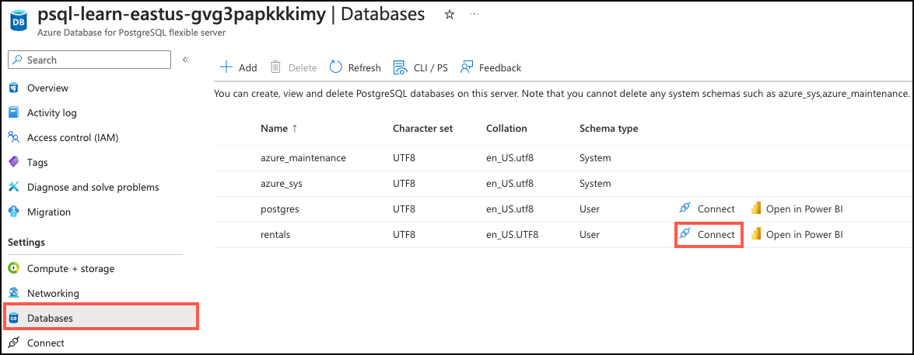

---
lab:
  title: 为建议系统创建搜索函数
  module: Enable Semantic Search with Azure Database for PostgreSQL
---

# 为建议系统创建搜索函数

让我们使用语义搜索构建建议系统。 系统会根据提供的示例列表推荐多个列表。 该示例可能来自用户正在查看的列表或其首选项。 我们将利用 `azure_openai` 扩展将系统实现为 PostgreSQL 函数。

在本练习结束时，你将定义一个函数`recommend_listing`，该函数最多能提供与所提供的 `sampleListingId` 最相似的 `numResults` 列表。 可以使用此数据来推动新机会，例如，根据折扣列表加入建议列表。

## 开始之前

你需要一个具有管理权限的 [Azure 订阅](https://azure.microsoft.com/free)，并且必须在该订阅中获得 Azure OpenAI 访问许可。 如果需要 Azure OpenAI 访问权限，请在 [Azure OpenAI 受限访问](https://learn.microsoft.com/legal/cognitive-services/openai/limited-access)页进行申请。

### 在你的 Azure 订阅上部署资源

此步骤指导你使用 Azure Cloud Shell 中的 Azure CLI 命令创建资源组并运行 Bicep 脚本，以将完成此练习所需的 Azure 服务部署到你的 Azure 订阅中。

1. 打开 web 浏览器，导航到 [Azure 门户](https://portal.azure.com/)。

2. 选择 Azure 门户工具栏中的“ **Cloud Shell** ”图标，以打开浏览器窗口底部的新“ [Cloud Shell](https://learn.microsoft.com/azure/cloud-shell/overview) ”窗格。

    

    如果出现提示，请选择打开 *Bash* shell 所需的选项。 如果以前使用过 *PowerShell* 控制台，请将其切换到 *Bash* shell。

3. 在 Cloud Shell 提示符下，输入以下内容以克隆包含练习资源的 GitHub 存储库：

    ```bash
    git clone https://github.com/MicrosoftLearning/mslearn-postgresql.git
    ```

4. 接下来，运行三个命令来定义变量，以在使用 Azure CLI 命令创建 Azure 资源时减少冗余键入。 变量表示要分配给资源组的名称（`RG_NAME`）、要将资源部署到的 Azure 区域（`REGION`）和随机生成的 PostgreSQL 管理员登录密码（`ADMIN_PASSWORD`）。

    在第一个命令中，分配给相应变量的区域是 `eastus`，但你也可以将其替换为首选位置。 但是，如果替换默认值，则必须选择另一个 [支持抽象摘要的 Azure 区域](https://learn.microsoft.com/azure/ai-services/language-service/summarization/region-support) ，以确保可以完成此学习路径中模块中的所有任务。

    ```bash
    REGION=eastus
    ```

    以下命令分配要用于资源组的名称，该资源组将容纳本练习中使用的所有资源。 分配给相应变量的资源组名称是 `rg-learn-postgresql-ai-$REGION`，其中 `$REGION` 是先前指定的位置。 但是，你可以将它更改为符合偏好的任何其他资源组名称。

    ```bash
    RG_NAME=rg-learn-postgresql-ai-$REGION
    ```

    最后一个命令随机生成 PostgreSQL 管理员登录的密码。 **请确保将其复制** 到安全位置，以便稍后连接到 PostgreSQL 灵活服务器。

    ```bash
    a=()
    for i in {a..z} {A..Z} {0..9}; 
     do
     a[$RANDOM]=$i
    done
    ADMIN_PASSWORD=$(IFS=; echo "${a[*]::18}")
    echo "Your randomly generated PostgreSQL admin user's password is:"
    echo $ADMIN_PASSWORD
    ```

5. 如果有权访问多个 Azure 订阅，而默认订阅不是要在其中为此练习创建资源组和其他资源的订阅，请运行此命令来设置相应的订阅，将 `<subscriptionName|subscriptionId>` 令牌替换为要使用的订阅的名称或 ID：

    ```azurecli
    az account set --subscription <subscriptionName|subscriptionId>
    ```

6. 运行以下 Azure CLI 命令创建资源组：

    ```azurecli
    az group create --name $RG_NAME --location $REGION
    ```

7. 最后，使用 Azure CLI 执行 Bicep 部署脚本，在资源组中预配 Azure 资源：

    ```azurecli
    az deployment group create --resource-group $RG_NAME --template-file "mslearn-postgresql/Allfiles/Labs/Shared/deploy.bicep" --parameters restore=false adminLogin=pgAdmin adminLoginPassword=$ADMIN_PASSWORD
    ```

    Bicep 部署脚本将完成此练习所需的 Azure 服务预配到你的资源组中。 部署的资源包括 Azure Database for PostgreSQL 灵活服务器、Azure OpenAI 和 Azure AI 语言服务。 Bicep 脚本还执行一些配置步骤，例如将 `azure_ai` 和 `vector` 扩展添加到 PostgreSQL 服务器的_允许列表_中（通过 `azure.extensions` 服务器参数），在服务器上创建名为 `rentals` 的数据库，并使用 `text-embedding-ada-002` 模型将名为 `embedding` 的部署添加到你的 Azure OpenAI 服务中。 请注意，Bicep 文件由此学习路径中的所有模块共享，因此在某些练习中只能使用某些已部署的资源。

    部署需要数分钟才能完成。 你可以从 Cloud Shell 监视它，也可以导航到先前创建的资源组的“**部署**”页，在那里观察部署进度。

8. 完成资源部署后，关闭 Cloud Shell 窗格。

### 排查部署错误

运行 Bicep 部署脚本时可能会遇到一些错误。

- 如果你以前为此学习路径运行过 Bicep 部署脚本并随后删除了资源，如果在删除资源后 48 小时内尝试重新运行该脚本，可能会收到如下所示的错误消息：

    ```bash
    {"code": "InvalidTemplateDeployment", "message": "The template deployment 'deploy' is not valid according to the validation procedure. The tracking id is '4e87a33d-a0ac-4aec-88d8-177b04c1d752'. See inner errors for details."}
    
    Inner Errors:
    {"code": "FlagMustBeSetForRestore", "message": "An existing resource with ID '/subscriptions/{subscriptionId}/resourceGroups/rg-learn-postgresql-ai-eastus/providers/Microsoft.CognitiveServices/accounts/{accountName}' has been soft-deleted. To restore the resource, you must specify 'restore' to be 'true' in the property. If you don't want to restore existing resource, please purge it first."}
    ```

    如果收到此消息，请修改上述 `azure deployment group create` 命令，将 `restore` 参数设置为 `true`，然后重新运行。

- 如果所选区域受限于预配特定资源，则必须将 `REGION` 变量设置为其他位置，然后重新运行命令以创建资源组并运行 Bicep 部署脚本。

    ```bash
    {"status":"Failed","error":{"code":"DeploymentFailed","target":"/subscriptions/{subscriptionId}/resourceGroups/{resourceGrouName}/providers/Microsoft.Resources/deployments/{deploymentName}","message":"At least one resource deployment operation failed. Please list deployment operations for details. Please see https://aka.ms/arm-deployment-operations for usage details.","details":[{"code":"ResourceDeploymentFailure","target":"/subscriptions/{subscriptionId}/resourceGroups/{resourceGrouName}/providers/Microsoft.DBforPostgreSQL/flexibleServers/{serverName}","message":"The resource write operation failed to complete successfully, because it reached terminal provisioning state 'Failed'.","details":[{"code":"RegionIsOfferRestricted","message":"Subscriptions are restricted from provisioning in this region. Please choose a different region. For exceptions to this rule please open a support request with Issue type of 'Service and subscription limits'. See https://review.learn.microsoft.com/en-us/azure/postgresql/flexible-server/how-to-request-quota-increase for more details."}]}]}}
    ```

- 如果脚本由于必须接受负责任的 AI 协议而无法创建 AI 资源，则可能会遇到以下错误：在这种情况下，使用 Azure 门户用户界面创建 Azure AI 服务资源，然后重新运行部署脚本。

    ```bash
    {"code": "InvalidTemplateDeployment", "message": "The template deployment 'deploy' is not valid according to the validation procedure. The tracking id is 'f8412edb-6386-4192-a22f-43557a51ea5f'. See inner errors for details."}
     
    Inner Errors:
    {"code": "ResourceKindRequireAcceptTerms", "message": "This subscription cannot create TextAnalytics until you agree to Responsible AI terms for this resource. You can agree to Responsible AI terms by creating a resource through the Azure Portal then trying again. For more detail go to https://go.microsoft.com/fwlink/?linkid=2164190"}
    ```

## 在 Azure Cloud Shell 中使用 psql 连接到数据库

在此任务中，你将使用 [psql 命令行实用工具](https://www.postgresql.org/docs/current/app-psql.html)从 [Azure Cloud Shell](https://learn.microsoft.com/azure/cloud-shell/overview) 连接到 Azure Database for PostgreSQL 服务器上的 `rentals` 数据库。

1. 在 [Azure 门户](https://portal.azure.com/)中，导航到新创建的 Azure Database for PostgreSQL 灵活服务器。

2. 在资源菜单中的“**设置**”下，选择“**数据库**”为 `rentals` 数据库选择“**连接**”。 请注意，选择“**连接**”并不会直接连接到数据库，而是提供了多种连接数据库的说明。 查看“**从浏览器或本地连接**”中的说明，并按照这些说明通过 Azure Cloud Shell 建立连接。

    

3. 在 Cloud Shell 中的“用户 pgAdmin 密码”提示符处，输入随机生成的 **pgAdmin** 登录密码。

    登录后，将显示 `rentals` 数据库的 `psql` 提示。

4. 在本练习的其余部分中，可以继续在 Cloud Shell 中工作，因此选择窗格右上方的“**最大化**”按钮来展开浏览器窗口中的窗格可能会有所帮助。

    

## 安装：配置扩展

若要存储和查询向量以及生成嵌入内容，需要允许列表并为 Azure Database for PostgreSQL 灵活服务器启用两个扩展：`vector` 和 `azure_ai`。

1. 若要同时列出扩展，请按照 [如何使用 PostgreSQL 扩展](https://learn.microsoft.com/en-us/azure/postgresql/flexible-server/concepts-extensions#how-to-use-postgresql-extensions) 中提供的说明，在服务器参数 `azure.extensions` 中添加 `vector` 和 `azure_ai`。

2. 运行以下 SQL 命令启用 `vector` 扩展。 有关详细说明，请阅读[如何在 Azure Database for PostgreSQL 灵活服务器上启用和使用 `pgvector`](https://learn.microsoft.com/en-us/azure/postgresql/flexible-server/how-to-use-pgvector#enable-extension)。

    ```sql
    CREATE EXTENSION vector;
    ```

3. 要启用 `azure_ai` 扩展，请运行以下 SQL 命令。 你需要 Azure OpenAI 资源的终结点和 API 密钥。 有关详细说明，请阅读[启用 `azure_ai` 扩展](https://learn.microsoft.com/en-us/azure/postgresql/flexible-server/generative-ai-azure-overview#enable-the-azure_ai-extension)。

    ```sql
    CREATE EXTENSION azure_ai;
    SELECT azure_ai.set_setting('azure_openai.endpoint', 'https://<endpoint>.openai.azure.com');
    SELECT azure_ai.set_setting('azure_openai.subscription_key', '<API Key>');
    ```

## 在数据库中填充示例数据

在探索 `azure_ai` 扩展之前，请在 `rentals` 数据库中添加几个表，并在其中填入示例数据，这样你在查看扩展功能时就有了可用的信息。

1. 运行以下命令创建 `listings` 和 `reviews` 表，用于存储租赁属性列表和客户评审数据：

    ```sql
    DROP TABLE IF EXISTS listings;
    
    CREATE TABLE listings (
        id int,
        name varchar(100),
        description text,
        property_type varchar(25),
        room_type varchar(30),
        price numeric,
        weekly_price numeric
    );
    ```

2. 接下来，使用 `COPY` 命令将数据从 CSV 文件加载到上面创建的每个表中。 执行以下命令以填充 `listings` 表：

    ```sql
    \COPY listings FROM 'mslearn-postgresql/Allfiles/Labs/Shared/listings.csv' CSV HEADER
    ```

    命令输出应为 `COPY 50`，指示从 CSV 文件写入表中的 50 行。

## 创建和存储嵌入向量

现在我们有了一些示例数据，接下来可以生成和存储嵌入向量。 该 `azure_ai` 扩展使调用 Azure OpenAI 嵌入 API 变得简单。

1. 添加嵌入向量列。

    `text-embedding-ada-002` 模型配置为返回 1,536 个维度，因此请对向量列大小使用该维度。

    ```sql
    ALTER TABLE listings ADD COLUMN listing_vector vector(1536);
    ```

1. 通过 create_embeddings 用户定义的函数（由 azure_ai 扩展实现）调用 Azure OpenAI，为每个列表的说明生成嵌入向量：

    ```sql
    UPDATE listings
    SET listing_vector = azure_openai.create_embeddings('embedding', description, max_attempts => 5, retry_delay_ms => 500)
    WHERE listing_vector IS NULL;
    ```

    请注意，这可能需要几分钟时间，具体取决于可用配额。

1. 通过运行此查询查看示例向量：

    ```sql
    SELECT listing_vector FROM listings LIMIT 1;
    ```

    你将获得如下所示的结果，但具有 1536 向量列：

    ```sql
    postgres=> SELECT listing_vector FROM listings LIMIT 1;
    -[ RECORD 1 ]--+------ ...
    listing_vector | [-0.0018742813,-0.04530062,0.055145424, ... ]
    ```

## 创建建议函数

建议函数采用 `sampleListingId` 并返回 `numResults` 最相似的其他列表。 为此，它会创建示例列表名称和说明的嵌入，并针对列表嵌入运行该查询向量的语义搜索。

```sql
CREATE FUNCTION
    recommend_listing(sampleListingId int, numResults int) 
RETURNS TABLE(
            out_listingName text,
            out_listingDescription text,
            out_score real)
AS $$ 
DECLARE
    queryEmbedding vector(1536); 
    sampleListingText text; 
BEGIN 
    sampleListingText := (
     SELECT
        name || ' ' || description
     FROM
        listings WHERE id = sampleListingId
    ); 

    queryEmbedding := (
     azure_openai.create_embeddings('embedding', sampleListingText, max_attempts => 5, retry_delay_ms => 500)
    );

    RETURN QUERY 
    SELECT
        name::text,
        description,
        -- cosine distance:
        (listings.listing_vector <=> queryEmbedding)::real AS score
    FROM
        listings 
    ORDER BY score ASC LIMIT numResults;
END $$
LANGUAGE plpgsql; 
```

请参阅 [建议系统](https://learn.microsoft.com/en-us/azure/postgresql/flexible-server/generative-ai-recommendation-system) 示例，了解自定义此函数的更多方法，例如，将多个文本列组合到嵌入向量中。

## 查询建议函数

若要查询建议函数，请向其传递一个列表 ID 及其应提供的建议数。

```sql
select out_listingName, out_score from recommend_listing( (SELECT id from listings limit 1), 20); -- search for 20 listing recommendations closest to a listing
```

结果如下所示：

```sql
            out_listingname          | out_score 
-------------------------------------+-------------
 Sweet Seattle Urban Homestead 2 Bdr | 0.012512862
 Lovely Cap Hill Studio has it all!  | 0.09572035
 Metrobilly Retreat                  | 0.0982959
 Cozy Seattle Apartment Near UW      | 0.10320047
 Sweet home in the heart of Fremont  | 0.10442386
 Urban Chic, West Seattle Apartment  | 0.10654513
 Private studio apartment with deck  | 0.107096426
 Light and airy, steps to the Lake.  | 0.11008232
 Backyard Studio Apartment near UW   | 0.111279964
 2bed Rm Inner City Suite Near Dwtn  | 0.111340374
 West Seattle Vacation Junction      | 0.111758955
 Green Lake Private Ground Floor BR  | 0.112196356
 Stylish Queen Anne Apartment        | 0.11250153
 Family Friendly Modern Seattle Home | 0.11257711
 Bright Cheery Room in Seattle House | 0.11290849
 Big sunny central house with view!  | 0.11382967
 Modern, Light-Filled Fremont Flat   | 0.114443965
 Chill Central District 2BR          | 0.1153879
 Sunny Bedroom w/View: Wallingford   | 0.11549795
 Seattle Turret House (Apt 4)        | 0.11590502
```

若要查看函数运行时，请确保 `track_functions` 已在 Azure 门户上的“服务器参数”部分中启用（可以使用 `PL` 或 `ALL`）：


然后，你可以查询函数统计信息表：

```sql
SELECT * FROM pg_stat_user_functions WHERE funcname = 'recommend_listing';
```

结果应类似于：

```sql
 funcid | schemaname |    funcname       | calls | total_time | self_time 
--------+------------+-------------------+-------+------------+-----------
  28753 | public     | recommend_listing |     1 |    268.357 | 268.357
(1 row)
```

在此基准中，我们获取了示例列表的嵌入，并在约 270 毫秒内对大约 4000 个文档执行语义搜索。

## 检查你的工作

1. 确保函数具有正确的签名：

    ```sql
    \df recommend_listing
    ```

    应该看到以下内容：

    ```sql
    public | recommend_listing | TABLE(out_listingname text, out_listingdescription text, out_score real) | samplelistingid integer, numre
    sults integer | func
    ```

2. 请确保可以使用以下查询对其进行查询：

    ```sql
    select out_listingName, out_score from recommend_listing( (SELECT id from listings limit 1), 20); -- search for 20 listing recommendations closest to a listing
    ```

## 清理

完成本练习后，请删除已创建的 Azure 资源。 需要基于已配置的容量付费，而不是基于数据库的使用量付费。 按照这些说明删除资源组和为此实验室创建的所有资源。

> [!Note]
>
> 如果你计划完成此学习路径中的其他模块，则可以跳过此任务，直到完成所有要完成的模块。

1. 打开 Web 浏览器并导航到 [Azure 门户](https://portal.azure.com/)，然后在主页上选择 Azure 服务下的**资源组**。

    

2. 在任意字段筛选器的搜索框中，输入为此实验室创建的资源组名称，然后从列表中选择资源组。

3. 在资源组的“概述”页面中，选择“删除资源组” 。

    

4. 在“确认”对话框中，输入要删除的资源组名称进行确认，然后选择“**删除**”。
