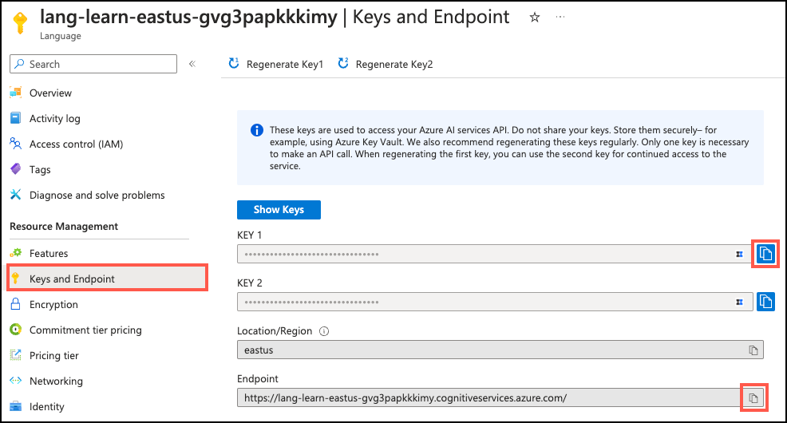

---
lab:
  title: 执行抽取式和抽象式摘要
  module: Summarize data using Azure AI Services and Azure Database for PostgreSQL
---

# 执行抽取式和抽象式摘要

由 Margie's Travel 维护的租赁物业应用为物业经理提供了一种描述租赁清单的方式。 系统中的许多描述都很长，提供了许多有关租赁物业、周边环境和当地景点、商店和其他设施的详细信息。 在你为应用实现新的由 AI 支持的功能时，有一个被请求的功能是使用生成式 AI 来创建这些描述的简洁摘要，以便用户能够更快速地浏览属性信息。 在本练习中，你将使用 Azure Database For PostgreSQL 灵活服务器中的 `azure_ai` 扩展对租赁物业描述执行抽象式和抽取式摘要，并比较生成的摘要。

## 开始之前

你需要具有管理权限的 [Azure 订阅](https://azure.microsoft.com/free)。

### 在你的 Azure 订阅上部署资源

此步骤指导你使用 Azure Cloud Shell 中的 Azure CLI 命令创建资源组并运行 Bicep 脚本，以将完成此练习所需的 Azure 服务部署到你的 Azure 订阅中。

1. 打开 web 浏览器，导航到 [Azure 门户](https://portal.azure.com/)。

2. 选择 Azure 门户工具栏中的“ **Cloud Shell** ”图标，以打开浏览器窗口底部的新“ [Cloud Shell](https://learn.microsoft.com/azure/cloud-shell/overview) ”窗格。

    

    如果出现提示，请选择打开 *Bash* shell 所需的选项。 如果以前使用过 *PowerShell* 控制台，请将其切换到 *Bash* shell。

3. 在 Cloud Shell 提示符下，输入以下内容以克隆包含练习资源的 GitHub 存储库：

    ```bash
    git clone https://github.com/MicrosoftLearning/mslearn-postgresql.git
    ```

4. 接下来，运行三个命令来定义变量，以在使用 Azure CLI 命令创建 Azure 资源时减少冗余键入。 变量表示要分配给资源组的名称（`RG_NAME`）、要将资源部署到的 Azure 区域（`REGION`）和随机生成的 PostgreSQL 管理员登录密码（`ADMIN_PASSWORD`）。

    在第一个命令中，分配给相应变量的区域是 `eastus`，但你也可以将其替换为首选位置。 但是，如果替换默认值，则必须选择另一个 [支持抽象摘要的 Azure 区域](https://learn.microsoft.com/azure/ai-services/language-service/summarization/region-support) ，以确保可以完成此学习路径中模块中的所有任务。

    ```bash
    REGION=eastus
    ```

    以下命令分配要用于资源组的名称，该资源组将容纳本练习中使用的所有资源。 分配给相应变量的资源组名称是 `rg-learn-postgresql-ai-$REGION`，其中 `$REGION` 是先前指定的位置。 但是，你可以将它更改为符合偏好的任何其他资源组名称。

    ```bash
    RG_NAME=rg-learn-postgresql-ai-$REGION
    ```

    最后一个命令随机生成 PostgreSQL 管理员登录的密码。 **请确保将其复制** 到安全位置，以便稍后连接到 PostgreSQL 灵活服务器。

    ```bash
    a=()
    for i in {a..z} {A..Z} {0..9}; 
        do
        a[$RANDOM]=$i
        done
    ADMIN_PASSWORD=$(IFS=; echo "${a[*]::18}")
    echo "Your randomly generated PostgreSQL admin user's password is:"
    echo $ADMIN_PASSWORD
    ```

5. 如果有权访问多个 Azure 订阅，而默认订阅不是要在其中为此练习创建资源组和其他资源的订阅，请运行此命令来设置相应的订阅，将 `<subscriptionName|subscriptionId>` 令牌替换为要使用的订阅的名称或 ID：

    ```azurecli
    az account set --subscription <subscriptionName|subscriptionId>
    ```

6. 运行以下 Azure CLI 命令创建资源组：

    ```azurecli
    az group create --name $RG_NAME --location $REGION
    ```

7. 最后，使用 Azure CLI 执行 Bicep 部署脚本，在资源组中预配 Azure 资源：

    ```azurecli
    az deployment group create --resource-group $RG_NAME --template-file "mslearn-postgresql/Allfiles/Labs/Shared/deploy.bicep" --parameters restore=false adminLogin=pgAdmin adminLoginPassword=$ADMIN_PASSWORD
    ```

    Bicep 部署脚本将完成此练习所需的 Azure 服务预配到你的资源组中。 部署的资源包括 Azure Database for PostgreSQL 灵活服务器、Azure OpenAI 和 Azure AI 语言服务。 Bicep 脚本还执行一些配置步骤，例如将 `azure_ai` 和 `vector` 扩展添加到 PostgreSQL 服务器的_允许列表_（通过 azure.extensions 服务器参数）、在服务器上创建名为 `rentals` 的数据库，以及使用 `text-embedding-ada-002` 模型将名为 `embedding` 的部署添加到 Azure OpenAI 服务。 请注意，Bicep 文件由此学习路径中的所有模块共享，因此在某些练习中只能使用某些已部署的资源。

    部署需要数分钟才能完成。 你可以从 Cloud Shell 监视它，也可以导航到先前创建的资源组的“**部署**”页，在那里观察部署进度。

8. 完成资源部署后，关闭 Cloud Shell 窗格。

### 排查部署错误

运行 Bicep 部署脚本时可能会遇到一些错误。

- 如果你以前为此学习路径运行过 Bicep 部署脚本并随后删除了资源，如果在删除资源后 48 小时内尝试重新运行该脚本，可能会收到如下所示的错误消息：

    ```bash
    {"code": "InvalidTemplateDeployment", "message": "The template deployment 'deploy' is not valid according to the validation procedure. The tracking id is '4e87a33d-a0ac-4aec-88d8-177b04c1d752'. See inner errors for details."}
    
    Inner Errors:
    {"code": "FlagMustBeSetForRestore", "message": "An existing resource with ID '/subscriptions/{subscriptionId}/resourceGroups/rg-learn-postgresql-ai-eastus/providers/Microsoft.CognitiveServices/accounts/{accountName}' has been soft-deleted. To restore the resource, you must specify 'restore' to be 'true' in the property. If you don't want to restore existing resource, please purge it first."}
    ```

    如果收到此消息，请修改上述 `azure deployment group create` 命令，将 `restore` 参数设置为 `true`，然后重新运行。

- 如果所选区域受限于预配特定资源，则必须将 `REGION` 变量设置为其他位置，然后重新运行命令以创建资源组并运行 Bicep 部署脚本。

    ```bash
    {"status":"Failed","error":{"code":"DeploymentFailed","target":"/subscriptions/{subscriptionId}/resourceGroups/{resourceGrouName}/providers/Microsoft.Resources/deployments/{deploymentName}","message":"At least one resource deployment operation failed. Please list deployment operations for details. Please see https://aka.ms/arm-deployment-operations for usage details.","details":[{"code":"ResourceDeploymentFailure","target":"/subscriptions/{subscriptionId}/resourceGroups/{resourceGrouName}/providers/Microsoft.DBforPostgreSQL/flexibleServers/{serverName}","message":"The resource write operation failed to complete successfully, because it reached terminal provisioning state 'Failed'.","details":[{"code":"RegionIsOfferRestricted","message":"Subscriptions are restricted from provisioning in this region. Please choose a different region. For exceptions to this rule please open a support request with Issue type of 'Service and subscription limits'. See https://review.learn.microsoft.com/en-us/azure/postgresql/flexible-server/how-to-request-quota-increase for more details."}]}]}}
    ```

- 如果脚本由于必须接受负责任的 AI 协议而无法创建 AI 资源，则可能会遇到以下错误：在这种情况下，使用 Azure 门户用户界面创建 Azure AI 服务资源，然后重新运行部署脚本。

    ```bash
    {"code": "InvalidTemplateDeployment", "message": "The template deployment 'deploy' is not valid according to the validation procedure. The tracking id is 'f8412edb-6386-4192-a22f-43557a51ea5f'. See inner errors for details."}
     
    Inner Errors:
    {"code": "ResourceKindRequireAcceptTerms", "message": "This subscription cannot create TextAnalytics until you agree to Responsible AI terms for this resource. You can agree to Responsible AI terms by creating a resource through the Azure Portal then trying again. For more detail go to https://go.microsoft.com/fwlink/?linkid=2164190"}
    ```


## 在 Azure Cloud Shell 中使用 psql 连接到数据库

在此任务中，你将使用 [psql 命令行实用工具](https://www.postgresql.org/docs/current/app-psql.html)从 [Azure Cloud Shell](https://learn.microsoft.com/azure/cloud-shell/overview) 连接到 Azure Database for PostgreSQL 灵活服务器上的 `rentals` 数据库。

1. 在 [Azure 门户](https://portal.azure.com/)中，导航到新创建的 Azure Database for PostgreSQL 灵活服务器实例。

2. 在资源菜单中的“**设置**”下，选择“**数据库**”为 `rentals` 数据库选择“**连接**”。 请注意，选择“**连接**”并不会直接连接到数据库，而是提供了多种连接数据库的说明。 查看“**从浏览器或本地连接**”中的说明，并按照这些说明通过 Azure Cloud Shell 建立连接。

    

3. 在 Cloud Shell 中的“用户 pgAdmin 密码”提示符处，输入随机生成的 **pgAdmin** 登录密码。

    登录后，将显示 `rentals` 数据库的 `psql` 提示。

4. 在本练习的其余部分中，可以继续在 Cloud Shell 中工作，因此选择窗格右上方的“**最大化**”按钮来展开浏览器窗口中的窗格可能会有所帮助。

    

## 在数据库中填充示例数据

在探索 `azure_ai` 扩展之前，请在 `rentals` 数据库中添加几个表，并在其中填入示例数据，这样你在查看扩展功能时就有了可用的信息。

1. 运行以下命令创建 `listings` 和 `reviews` 表，用于存储租赁属性列表和客户评审数据：

    ```sql
    DROP TABLE IF EXISTS listings;

    CREATE TABLE listings (
        id int,
        name varchar(100),
        description text,
        property_type varchar(25),
        room_type varchar(30),
        price numeric,
        weekly_price numeric
    );
    ```

    ```sql
    DROP TABLE IF EXISTS reviews;

    CREATE TABLE reviews (
        id int,
        listing_id int, 
        date date,
        comments text
    );
    ```

2. 接下来，使用 `COPY` 命令将数据从 CSV 文件加载到上面创建的每个表中。 执行以下命令以填充 `listings` 表：

    ```sql
    \COPY listings FROM 'mslearn-postgresql/Allfiles/Labs/Shared/listings.csv' CSV HEADER
    ```

    命令输出应为 `COPY 50`，指示从 CSV 文件写入表中的 50 行。

3. 最后，运行以下命令，将客户评论加载到 `reviews` 表中：

    ```sql
    \COPY reviews FROM 'mslearn-postgresql/Allfiles/Labs/Shared/reviews.csv' CSV HEADER
    ```

    命令输出应为 `COPY 354`，指示已从 CSV 文件写入表中 354 行。

## 安装和配置 `azure_ai` 扩展

使用 `azure_ai` 扩展之前，必须先将其安装到数据库中，并将其配置为连接到 Azure AI Services 资源。 `azure_ai` 扩展允许将 Azure OpenAI 和 Azure AI 语言服务集成到数据库中。 要在数据库中启用该扩展，请按照以下步骤操作：

1. 在 `psql` 提示符处执行以下命令，验证设置环境时运行的 Bicep 部署脚本是否已成功将 `azure_ai` 扩展和 `vector` 扩展添加到服务器的_允许列表_：

    ```sql
    SHOW azure.extensions;
    ```

    该命令显示服务器_允许列表_上的扩展列表。 如果所有内容都正确安装，则输出必须包含 `azure_ai` 和 `vector`，如下所示：

    ```sql
     azure.extensions 
    ------------------
     azure_ai,vector
    ```

    在 Azure Database for PostgreSQL 灵活服务器数据库中安装和使用扩展之前，必须将其添加到服务器的_允许列表_，如[如何使用 PostgreSQL 扩展](https://learn.microsoft.com/azure/postgresql/flexible-server/concepts-extensions#how-to-use-postgresql-extensions)中所述。

2. 现在，可以使用 [CREATE EXTENSION](https://www.postgresql.org/docs/current/sql-createextension.html) 命令安装 `azure_ai` 扩展。

    ```sql
    CREATE EXTENSION IF NOT EXISTS azure_ai;
    ```

    `CREATE EXTENSION` 通过运行其脚本文件将新扩展加载到数据库。 此脚本通常新建 SQL 对象，例如函数、数据类型和架构。 如果已存在同名的扩展，则会引发错误。 添加 `IF NOT EXISTS` 允许命令执行，而不会在已安装时引发错误。

## 连接 Azure AI 服务帐户

`azure_ai` 扩展的 `azure_cognitive` 架构中包含的 Azure AI 服务集成提供了一套丰富的 AI 语言功能，可直接从数据库使用。 文本摘要功能通过 [Azure AI 语言服务](https://learn.microsoft.com/azure/ai-services/language-service/overview)启用。

1. 若要使用 `azure_ai` 成功调用 Azure AI 语言服务，必须向扩展提供其终结点和密钥。 使用打开 Cloud Shell 的同一浏览器选项卡，在 [Azure 门户](https://portal.azure.com/)中导航到语言服务资源，并从左侧导航菜单的“**资源管理**”下选择“**密钥和终结点**”项。

    

    > [!Note]
    >
    > 如果安装上述 `azure_ai` 扩展时收到消息 `NOTICE: extension "azure_ai" already exists, skipping CREATE EXTENSION`，并且之前已使用语言服务终结点和密钥配置了此扩展，则可以使用 `azure_ai.get_setting()` 函数确认这些设置正确，然后跳过步骤 2（如果正确）。

2. 复制终结点和访问密钥值，然后在下面的命令中，将 `{endpoint}` 和 `{api-key}` 令牌替换为从 Azure 门户复制的值。 从 Cloud Shell 中的 `psql` 命令提示符运行命令，将值添加到 `azure_ai.settings` 表中。

    ```sql
    SELECT azure_ai.set_setting('azure_cognitive.endpoint', '{endpoint}');
    ```

    ```sql
    SELECT azure_ai.set_setting('azure_cognitive.subscription_key', '{api-key}');
    ```

## 查看扩展的摘要功能

在此任务中，你将查看 `azure_cognitive` 架构中的两个摘要函数。

1. 在本练习的其余部分，你将专门在 Cloud Shell 中工作，因此通过选择 Cloud Shell 窗格右上角的“**最大化**”按钮来展开浏览器窗口中的窗格可能会很有帮助。

    

2. 在 Cloud Shell 中使用 `psql` 时，对查询结果启用扩展显示可能会有所帮助，因为它可以提高后续命令输出的可读性。 执行以下命令以允许自动应用扩展显示。

    ```sql
    \x auto
    ```

3. `azure_ai` 扩展的文本摘要函数可在 `azure_cognitive` 架构中找到。 对于抽取式摘要，请使用 `summarize_extractive()` 函数。 使用 [`\df`meta-command](https://www.postgresql.org/docs/current/app-psql.html#APP-PSQL-META-COMMAND-DF-LC) 来检查函数，运行：

    ```sql
    \df azure_cognitive.summarize_extractive
    ```

    元命令输出显示函数的架构、名称、结果数据类型和参数。 此信息有助于理解如何与查询中的函数交互。

    输出显示 `summarize_extractive()` 函数的三个重载，使你能够查看它们之间的差异。 输出中的 `Argument data types` 属性显示三个函数重载所需的参数列表：

    | 参数 | 类型 | 默认 | 说明 |
    | -------- | ---- | ------- | ----------- |
    | text | `text` 或 `text[]` || 要为其生成摘要的文本。 |
    | language_text | `text` 或 `text[]` || 语言代码（或语言代码数组）表示要汇总的文本的语言。 查看[支持的语言列表](https://learn.microsoft.com/azure/ai-services/language-service/summarization/language-support)以检索所需的语言代码。 |
    | sentence_count | `integer` | 3 | 要生成的摘要句子的数量。 |
    | sort_by | `text` | “偏移量” | 生成的摘要句子的排序顺序。 可接受的值为“偏移量”和“排名”，其中偏移量表示原始内容中每个提取的句子的起始位置，排名是 AI 生成的指示句子与内容主要思想相关程度的指示器。 |
    | batch_size | `integer` | 25 | 仅适用于需要 `text[]` 输入的两个重载。 指定一次要处理的记录数。 |
    | disable_service_logs | `boolean` | false | 用于指示是否关闭服务日志的标志。 |
    | timeout_ms | `integer` | Null | 超时的毫秒数，超过该时间后操作将停止。 |
    | throw_on_error | `boolean` | 是 | 指示函数是否应在出错时引发异常，从而导致包装事务回滚的标志。 |
    | max_attempts | `integer` | 1 | 在发生故障时尝试重新调用 Azure AI 服务的次数。 |
    | retry_delay_ms | `integer` | 1000 | 尝试重新调用 Azure AI 服务终结点之前等待的时间（以毫秒为单位）。 |

4. 重复上述步骤，但这次要为 `azure_cognitive.summarize_abstractive()` 函数运行 [`\df`meta-command](https://www.postgresql.org/docs/current/app-psql.html#APP-PSQL-META-COMMAND-DF-LC)，并查看输出。

    这两个函数的签名相似，但 `summarize_abstractive()` 没有 `sort_by` 参数，它返回的是 `text` 数组，而 `summarize_extractive()` 函数返回的是 `azure_cognitive.sentence` 复合类型数组。 这种差异与两种不同的方法生成摘要的方式有关。 提取式摘要能找出所摘要文本中最关键的句子，对其进行排序，然后将这些句子作为摘要返回。 另一方面，抽象摘要使用生成式 AI 创建新的原始句子来汇总文本的关键点。

5. 还必须了解函数返回的数据类型的结构，以便正确处理查询中的输出。 要检查 `summarize_extractive()` 函数返回的 `azure_cognitive.sentence` 类型，请运行：

    ```sql
    \dT+ azure_cognitive.sentence
    ```

6. 上述命令的输出显示，`sentence` 类型是 `tuple`。 要检查 `tuple` 的结构并查看 `sentence` 复合类型中包含的列，请执行以下命令：

    ```sql
    \d+ azure_cognitive.sentence
    ```

    该命令的输出应如下所示：

    ```sql
                            Composite type "azure_cognitive.sentence"
        Column  |     Type         | Collation | Nullable | Default | Storage  | Description 
    ------------+------------------+-----------+----------+---------+----------+-------------
     text       | text             |           |           |        | extended | 
     rank_score | double precision |           |           |        | plain    |
    ```

    `azure_cognitive.sentence` 是一种复合类型，包含提取句子的文本和每个句子的等级分，表示该句子与文本主旨的相关程度。 文档摘要会对提取的句子进行排名，你可以确定这些句子是按其出现的顺序还是按其排名来返回。

## 为属性说明创建摘要

在此任务中，你将使用 `summarize_extractive()` 和 `summarize_abstractive()` 函数为属性说明创建简洁的双句摘要。

1. 现在，你已查看 `summarize_extractive()` 函数及其 `sentiment_analysis_result` 返回，接下来让我们放置要使用的函数。 执行以下简单查询，对 `reviews` 表中的一些注释进行情绪分析：

    ```sql
    SELECT
        id,
        name,
        description,
        azure_cognitive.summarize_extractive(description, 'en', 2) AS extractive_summary
    FROM listings
    WHERE id IN (1, 2);
    ```

    将输出中 `extractive_summary` 字段中的两个句子与原始 `description` 句子进行比较，注意句子不是原始的，而是从 `description` 中提取的。 每个句子后列出的数值是语言服务分配的排名分数。

2. 接下来，对相同的记录执行抽象摘要：

    ```sql
    SELECT
        id,
        name,
        description,
        azure_cognitive.summarize_abstractive(description, 'en', 2) AS abstractive_summary
    FROM listings
    WHERE id IN (1, 2);
    ```

    扩展的抽象摘要功能提供独特的自然语言摘要，用于概括原始文本的整体意图。

    如果收到类似下面的错误，说明在创建 Azure 环境时选择了不支持抽象摘要的区域：

    ```bash
    ERROR: azure_cognitive.summarize_abstractive: InvalidRequest: Invalid Request.

    InvalidParameterValue: Job task: 'AbstractiveSummarization-task' failed with validation errors: ['Invalid Request.']

    InvalidRequest: Job task: 'AbstractiveSummarization-task' failed with validation error: Document abstractive summarization is not supported in the region Central US. The supported regions are North Europe, East US, West US, UK South, Southeast Asia.
    ```

    要执行此步骤并使用抽象摘要完成其余任务，必须在错误消息中指定的某个受支持区域中创建新的 Azure AI 语言服务。 可以在用于其他实验室资源的同一资源组中预配此服务。 或者，你可以将抽取式摘要替换为剩余任务，但不会获得能够比较两种不同摘要技术的输出的好处。

3. 运行最终查询以并行比较两种摘要技术：

    ```sql
    SELECT
        id,
        azure_cognitive.summarize_extractive(description, 'en', 2) AS extractive_summary,
        azure_cognitive.summarize_abstractive(description, 'en', 2) AS abstractive_summary
    FROM listings
    WHERE id IN (1, 2);
    ```

    通过将生成的摘要并排放置，可以轻松地比较每个方法生成的摘要的质量。 对于 Margie's Travel 应用程序，抽象摘要是更好的选择，提供简洁的摘要，以自然且可读的方式提供高质量的信息。 虽然提供了一些细节，但提取摘要更不连贯，并且提供的价值低于抽象摘要创建的原始内容。

## 在数据库中存储说明摘要

1. 运行以下查询以更改 `listings` 表，添加新 `summary` 列：

    ```sql
    ALTER TABLE listings
    ADD COLUMN summary text;
    ```

2. 若要使用生成式 AI 为数据库中的所有现有属性创建摘要，最好分批在说明中发送，让语言服务可以同时处理多条记录。

    ```sql
    WITH batch_cte AS (
        SELECT azure_cognitive.summarize_abstractive(ARRAY(SELECT description FROM listings ORDER BY id), 'en', batch_size => 25) AS summary
    ),
    summary_cte AS (
        SELECT
            ROW_NUMBER() OVER () AS id,
            ARRAY_TO_STRING(summary, ',') AS summary
        FROM batch_cte
    )
    UPDATE listings AS l
    SET summary = s.summary
    FROM summary_cte AS s
    WHERE l.id = s.id;
    ```

    update 语句使用两个通用表表达式 (CTEs) 处理数据，然后再使用摘要更新 `listings` 表。 第一个 CTE (`batch_cte`) 将 `listings` 表中的所有 `description` 值发送到语言服务，以生成抽象摘要。 它一次分批执行 25 条记录。 第二个 CTE (`summary_cte`) 使用 `summarize_abstractive()` 函数返回的摘要的序号位置，为每个摘要分配 `id` 对应于来自 `listings` 表中 `description` 的记录。 它还使用 `ARRAY_TO_STRING` 函数从文本数组 (`text[]`) 返回值中提取生成的摘要，并将其转换为简单的字符串。 最后，`UPDATE` 语句将摘要写入相关列表的 `listings` 表中。

3. 最后，运行查询，查看写入 `listings` 表的摘要：

    ```sql
    SELECT
        id,
        name,
        description,
        summary
    FROM listings
    LIMIT 5;
    ```

## 生成列表评审的 AI 摘要

对于 Margie's Travel 应用，显示属性的所有评论摘要可帮助用户快速评估评论的整体要点。

1. 运行以下查询，它将列表的所有评审合并到单个字符串中，然后基于该字符串生成抽象摘要：

    ```sql
    SELECT unnest(azure_cognitive.summarize_abstractive(reviews_combined, 'en')) AS review_summary
    FROM (
        -- Combine all reviews for a listing
        SELECT string_agg(comments, ' ') AS reviews_combined
        FROM reviews
        WHERE listing_id = 1
    );
    ```

## 清理

完成本练习后，请删除已创建的 Azure 资源。 需要基于已配置的容量付费，而不是基于数据库的使用量付费。 按照这些说明删除资源组和为此实验室创建的所有资源。

1. 打开 Web 浏览器并导航到 [Azure 门户](https://portal.azure.com/)，然后在主页的 Azure 服务下，选择“**资源组**”。

    

2. 在任意字段筛选器的搜索框中，输入为此实验室创建的资源组名称，然后从列表中选择资源组。

3. 在资源组的“概述”页面中，选择“删除资源组” 。

    

4. 在“确认”对话框中，输入要删除的资源组名称进行确认，然后选择“**删除**”。
