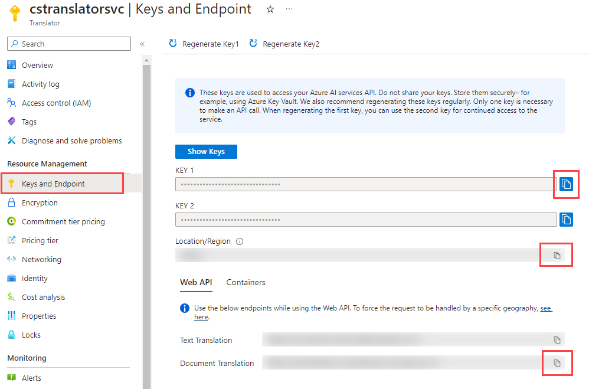

---
lab:
  title: 使用 Azure AI 翻译服务翻译文本
  module: Translate Text using the Azure AI Translator and Azure Database for PostgreSQL
---

# 使用 Azure AI 翻译服务翻译文本

作为 Margie's Travel 的主要开发人员，你被要求协助国际化工作。 今天，该公司短期租赁服务的所有租赁列表都采用英语。 你想要将这些列表翻译成多种语言，而无需大量的开发工作。 你的所有数据都托管在 Azure Database for PostgreSQL 灵活服务器中，并希望使用 Azure AI 服务来执行翻译。

在本练习中，你将通过 Azure Database for PostgreSQL 灵活服务器数据库使用 Azure AI 翻译服务将英语文本翻译为多种语言。

## 开始之前

你需要具有管理权限的 [Azure 订阅](https://azure.microsoft.com/free)。

### 在你的 Azure 订阅上部署资源

此步骤将指导你使用 Azure Cloud Shell 中的 Azure CLI 命令创建资源组并运行 Bicep 脚本，将完成本练习所需的 Azure 服务部署到 Azure 订阅中。

1. 打开 web 浏览器，导航到 [Azure 门户](https://portal.azure.com/)。

2. 选择 Azure 门户工具栏中的“ **Cloud Shell** ”图标，以打开浏览器窗口底部的新“ [Cloud Shell](https://learn.microsoft.com/azure/cloud-shell/overview) ”窗格。

    

    如果出现提示，请选择打开 *Bash* shell 所需的选项。 如果以前使用过 *PowerShell* 控制台，请将其切换到 *Bash* shell。

3. 在 Cloud Shell 提示符下，输入以下内容以克隆包含练习资源的 GitHub 存储库：

    ```bash
    git clone https://github.com/MicrosoftLearning/mslearn-postgresql.git
    ```

    如果已在上一模块中克隆了此 GitHub 存储库，该存储库仍可供你使用，并且可能会收到以下错误消息：

    ```bash
    fatal: destination path 'mslearn-postgresql' already exists and is not an empty directory.
    ```

    如果收到此消息，可以安全地继续执行下一步。

4. 接下来，运行三个命令来定义变量，以在使用 Azure CLI 命令创建 Azure 资源时减少冗余键入。 变量表示要分配给资源组的名称（`RG_NAME`）、要将资源部署到的 Azure 区域（`REGION`）和随机生成的 PostgreSQL 管理员登录密码（`ADMIN_PASSWORD`）。

    在第一个命令中，分配给相应变量的区域是 `eastus`，但你也可以将其替换为首选位置。 但是，如果替换默认值，则必须选择另一个 [支持抽象摘要的 Azure 区域](https://learn.microsoft.com/azure/ai-services/language-service/summarization/region-support) ，以确保可以完成此学习路径中模块中的所有任务。

    ```bash
    REGION=eastus
    ```

    以下命令分配要用于资源组的名称，该资源组将容纳本练习中使用的所有资源。 分配给相应变量的资源组名称是 `rg-learn-postgresql-ai-$REGION`，其中 `$REGION` 是上文指定的位置。 但是，你可以将它更改为符合偏好的任何其他资源组名称。

    ```bash
    RG_NAME=rg-learn-postgresql-ai-$REGION
    ```

    最后一个命令随机生成 PostgreSQL 管理员登录的密码。 请确保将其复制到安全位置，以便以后连接到 PostgreSQL 灵活服务器时使用。

    ```bash
    a=()
    for i in {a..z} {A..Z} {0..9}; 
       do
       a[$RANDOM]=$i
    done
    ADMIN_PASSWORD=$(IFS=; echo "${a[*]::18}")
    echo "Your randomly generated PostgreSQL admin user's password is:"
    echo $ADMIN_PASSWORD
    ```

5. 如果有权访问多个 Azure 订阅，并且默认订阅不是要为此练习创建资源组和其他资源的订阅，请运行此命令来设置相应的订阅，将 `<subscriptionName|subscriptionId>` 令牌替换为要使用的订阅的名称或 ID：

    ```azurecli
    az account set --subscription <subscriptionName|subscriptionId>
    ```

6. 运行以下 Azure CLI 命令创建资源组：

    ```azurecli
    az group create --name $RG_NAME --location $REGION
    ```

7. 最后，使用 Azure CLI 执行 Bicep 部署脚本，在资源组中预配 Azure 资源：

    ```azurecli
    az deployment group create --resource-group $RG_NAME --template-file "mslearn-postgresql/Allfiles/Labs/Shared/deploy-translate.bicep" --parameters restore=false adminLogin=pgAdmin adminLoginPassword=$ADMIN_PASSWORD
    ```

    Bicep 部署脚本将完成此练习所需的 Azure 服务预配到你的资源组中。 部署的资源包括 Azure Database for PostgreSQL 灵活服务器和 Azure AI Translator 服务。 Bicep 脚本还会执行一些配置步骤，例如将 `azure_ai` 和 `vector` 扩展添加到 PostgreSQL 服务器的_允许列表_中（通过 azure.extensions 服务器参数），并在服务器上创建名为 `rentals` 的数据库。 **请注意，Bicep 文件不同于此学习路径中的其他模块。**

    部署需要数分钟才能完成。 你可以从 Cloud Shell 监视它，也可以导航到上述创建的资源组的“**部署**”页面，在那里观察部署进度。

8. 完成资源部署后，关闭 Cloud Shell 窗格。

### 排查部署错误

运行 Bicep 部署脚本时可能会遇到一些错误。

- 如果你以前为此学习路径运行过 Bicep 部署脚本并随后删除了资源，如果在删除资源后 48 小时内尝试重新运行该脚本，可能会收到如下所示的错误消息：

    ```bash
    {"code": "InvalidTemplateDeployment", "message": "The template deployment 'deploy' is not valid according to the validation procedure. The tracking id is '4e87a33d-a0ac-4aec-88d8-177b04c1d752'. See inner errors for details."}
    
    Inner Errors:
    {"code": "FlagMustBeSetForRestore", "message": "An existing resource with ID '/subscriptions/{subscriptionId}/resourceGroups/rg-learn-postgresql-ai-eastus/providers/Microsoft.CognitiveServices/accounts/{accountName}' has been soft-deleted. To restore the resource, you must specify 'restore' to be 'true' in the property. If you don't want to restore existing resource, please purge it first."}
    ```

    如果收到此消息，请修改上述 `azure deployment group create` 命令，将 `restore` 参数设置为 `true`，然后重新运行。

- 如果所选区域受限于预配特定资源，则必须将 `REGION` 变量设置为其他位置，然后重新运行命令以创建资源组并运行 Bicep 部署脚本。

    ```bash
    {"status":"Failed","error":{"code":"DeploymentFailed","target":"/subscriptions/{subscriptionId}/resourceGroups/{resourceGrouName}/providers/Microsoft.Resources/deployments/{deploymentName}","message":"At least one resource deployment operation failed. Please list deployment operations for details. Please see https://aka.ms/arm-deployment-operations for usage details.","details":[{"code":"ResourceDeploymentFailure","target":"/subscriptions/{subscriptionId}/resourceGroups/{resourceGrouName}/providers/Microsoft.DBforPostgreSQL/flexibleServers/{serverName}","message":"The resource write operation failed to complete successfully, because it reached terminal provisioning state 'Failed'.","details":[{"code":"RegionIsOfferRestricted","message":"Subscriptions are restricted from provisioning in this region. Please choose a different region. For exceptions to this rule please open a support request with Issue type of 'Service and subscription limits'. See https://review.learn.microsoft.com/en-us/azure/postgresql/flexible-server/how-to-request-quota-increase for more details."}]}]}}
    ```

- 如果脚本由于接受负责任的 AI 协议的要求而无法创建 AI 资源，则可能会遇到以下错误：在这种情况下，使用 Azure 门户用户界面创建 Azure AI 服务资源，然后重新运行部署脚本。

    ```bash
    {"code": "InvalidTemplateDeployment", "message": "The template deployment 'deploy' is not valid according to the validation procedure. The tracking id is 'f8412edb-6386-4192-a22f-43557a51ea5f'. See inner errors for details."}
     
    Inner Errors:
    {"code": "ResourceKindRequireAcceptTerms", "message": "This subscription cannot create TextAnalytics until you agree to Responsible AI terms for this resource. You can agree to Responsible AI terms by creating a resource through the Azure Portal then trying again. For more detail go to https://go.microsoft.com/fwlink/?linkid=2164190"}
    ```

## 在 Azure Cloud Shell 中使用 psql 连接到数据库

在此任务中，你将使用 [psql 命令行实用工具](https://www.postgresql.org/docs/current/app-psql.html)从 [Azure Cloud Shell](https://learn.microsoft.com/azure/cloud-shell/overview) 连接到 Azure Database for PostgreSQL 服务器上的 `rentals` 数据库。

1. 在 [Azure 门户](https://portal.azure.com/)中，导航到新创建的 Azure Database for PostgreSQL 灵活服务器。

2. 在资源菜单中的“**设置**”下，选择“**数据库**”为 `rentals` 数据库选择“**连接**”。

    

3. 在 Cloud Shell 中的“用户 pgAdmin 密码”提示符下，输入随机生成的 **pgAdmin** 登录密码。

    登录后，将显示 `rentals` 数据库的 `psql` 提示。

4. 在本练习的其余部分中，可以继续在 Cloud Shell 中工作，因此选择窗格右上方的 **最大化** 按钮来展开浏览器窗口中的窗格可能会有所帮助。

    

## 用列表数据填充数据库

你需要提供英语列表数据才能翻译它们。 如果之前模块中尚未在 `rentals` 数据库中创建 `listings` 表，请按照以下说明创建该表。

1. 运行以下命令以创建用于存储租赁属性列表数据的 `listings` 表：

    ```sql
    CREATE TABLE listings (
        id int,
        name varchar(100),
        description text,
        property_type varchar(25),
        room_type varchar(30),
        price numeric,
        weekly_price numeric
    );
    ```

2. 接下来，使用 `COPY` 命令将数据从 CSV 文件加载到上面创建的每个表中。 执行以下命令以填充 `listings` 表：

    ```sql
    \COPY listings FROM 'mslearn-postgresql/Allfiles/Labs/Shared/listings.csv' CSV HEADER
    ```

    命令输出应为 `COPY 50`，指示从 CSV 文件写入表中的 50 行。

## 创建用于翻译的其他表

你已经有了 `listings` 数据，但需要另外两个表来执行翻译。

1. 运行以下命令创建 `languages` 和 `listing_translations` 表。

    ```sql
    CREATE TABLE languages (
        code VARCHAR(7) NOT NULL PRIMARY KEY
    );
    ```

    ```sql
    CREATE TABLE listing_translations(
        id INT GENERATED ALWAYS AS IDENTITY PRIMARY KEY,
        listing_id INT,
        language_code VARCHAR(7),
        description TEXT
    );
    ```

2. 接下来，为每个语言插入一行进行翻译。 在这种情况下，你将为五种语言创建行：德语、简体中文、印地语、匈牙利语和斯瓦希里语。

    ```sql
    INSERT INTO languages(code)
    VALUES
        ('de'),
        ('zh-Hans'),
        ('hi'),
        ('hu'),
        ('sw');
    ```

    命令输出应为 `INSERT 0 5`，指示已将五个新行插入表中。

## 安装和配置 `azure_ai` 扩展

在使用 `azure_ai` 扩展之前，必须先将其安装到数据库中，并将其配置为连接到 Azure AI 服务资源。 `azure_ai` 扩展让你能够将 Azure OpenAI 和 Azure AI 语言服务集成到数据库中。 要在数据库中启用该扩展，请执行以下步骤：

1. 在 `psql` 提示符处执行以下命令，验证设置环境时运行的 Bicep 部署脚本是否已成功将 `azure_ai` 扩展和 `vector` 扩展添加到服务器的“_允许列表中_”：

    ```sql
    SHOW azure.extensions;
    ```

    该命令显示服务器“_允许列表_”上的扩展列表。 如果所有内容都正确安装，则输出必须包含 `azure_ai` 和 `vector`，如下所示：

    ```sql
     azure.extensions 
    ------------------
     azure_ai,vector
    ```

    在 Azure Database for PostgreSQL 灵活服务器中安装和使用扩展之前，必须将其添加到服务器的_允许列表_中，如[如何使用 PostgreSQL 扩展](https://learn.microsoft.com/azure/postgresql/flexible-server/concepts-extensions#how-to-use-postgresql-extensions)中所述。

2. 现在，你已准备好使用 [CREATE EXTENSION](https://www.postgresql.org/docs/current/sql-createextension.html) 命令安装 `azure_ai` 扩展。

    ```sql
    CREATE EXTENSION IF NOT EXISTS azure_ai;
    ```

    `CREATE EXTENSION` 通过运行其脚本文件将新扩展加载到数据库中。 此脚本通常会创建新的 SQL 对象，例如函数、数据类型和架构。 如果已存在同名的扩展，则会引发错误。 添加 `IF NOT EXISTS` 允许命令在已经安装的情况下执行，而不会引发错误。

3. 然后，必须使用该 `azure_ai.set_setting()` 函数来配置与 Azure AI 翻译服务的连接。 使用打开 Cloud Shell 的同一浏览器选项卡，最小化或还原 Cloud Shell 窗格，然后导航到 [Azure 门户](https://portal.azure.com/)中的 Azure AI 翻译资源。 在 Azure AI 翻译资源页上，在资源菜单的**资源管理**部分下，选择“**密钥和终结点**”，然后复制其中一个可用密钥、区域和文档翻译终结点。

    

    可以使用 `KEY 1` 或 `KEY 2`。 始终准备好两个密钥可以安全地轮换和重新生成密钥，而不会导致服务中断。

4. 配置 `azure_cognitive` 设置以指向 AI 翻译终结点、订阅密钥和区域。 `azure_cognitive.endpoint` 的值将是服务的文档翻译 URL。 `azure_cognitive.subscription_key` 的值将是密钥 1 或密钥 2。 `azure_cognitive.region` 的值将是 Azure AI 翻译实例的区域。

    ```sql
    SELECT azure_ai.set_setting('azure_cognitive.endpoint','https://<YOUR_ENDPOINT>.cognitiveservices.azure.com/');
    SELECT azure_ai.set_setting('azure_cognitive.subscription_key', '<YOUR_KEY>');
    SELECT azure_ai.set_setting('azure_cognitive.region', '<YOUR_REGION>');
    ```

## 创建用于转换列表数据的存储过程

若要填充语言翻译表，你将创建一个存储过程以批量加载数据。

1. 在 `psql` 提示符下运行以下命令，创建名为 `translate_listing_descriptions` 的新存储过程。

    ```sql
    CREATE OR REPLACE PROCEDURE translate_listing_descriptions(max_num_listings INT DEFAULT 10)
    LANGUAGE plpgsql
    AS $$
    BEGIN
        WITH batch_to_load(id, description) AS
        (
            SELECT id, description
            FROM listings l
            WHERE NOT EXISTS (SELECT * FROM listing_translations ll WHERE ll.listing_id = l.id)
            LIMIT max_num_listings
        )
        INSERT INTO listing_translations(listing_id, language_code, description)
        SELECT b.id, l.code, (unnest(tr.translations)).TEXT
        FROM batch_to_load b
            CROSS JOIN languages l
            CROSS JOIN LATERAL azure_cognitive.translate(b.description, l.code) tr;
    END;
    $$;
    ```

    此存储过程将批量加载 5 条记录，翻译所选每种语言的描述，并将翻译后的描述插入 `listing_translations` 表。

2. 使用以下 SQL 命令执行存储过程：

    ```sql
    CALL translate_listing_descriptions(10);
    ```

    此调用大约需要一秒才能将每份租赁清单转换为五种语言，因此每次运行大约需要 10 秒。 命令输出应为 `CALL`，指示存储过程调用成功。

3. 再调用存储过程四次，即调用该存储过程五次。 这将为表中的每个列表生成翻译。

4. 运行以下脚本以获取列表翻译计数。

    ```sql
    SELECT COUNT(*) FROM listing_translations;
    ```

    该调用应返回值 250，表明每个列表已翻译成五种语言。 可以通过查询 `listing_translations` 表进一步分析数据。

## 创建使用翻译添加新列表的过程

你有一个存储过程来翻译现有列表，但你的国际化计划还要求在输入新列表时对其进行翻译。 为此，你将创建另一个存储过程。

1. 在 `psql` 提示符处运行以下命令，以创建名为 `add_listing` 的新存储过程。

    ```sql
    CREATE OR REPLACE PROCEDURE add_listing(id INT, name VARCHAR(255), description TEXT)
    LANGUAGE plpgsql
    AS $$
    DECLARE
    listing_id INT;
    BEGIN
        INSERT INTO listings(id, name, description)
        VALUES(id, name, description);

        INSERT INTO listing_translations(listing_id, language_code, description)
        SELECT id, l.code, (unnest(tr.translations)).TEXT
        FROM languages l
            CROSS JOIN LATERAL azure_cognitive.translate(description, l.code) tr;
    END;
    $$;
    ```

    此存储过程将在 `listings` 表中插入一行。 然后，它将翻译 `languages` 表中每种语言的描述，并将这些翻译插入到 `listing_translations` 表中。

2. 使用以下 SQL 命令执行存储过程：

    ```sql
    CALL add_listing(51, 'A Beautiful Home', 'This is a beautiful home in a great location.');
    ```

    命令输出应为 `CALL`，表明存储过程调用成功。

3. 运行以下脚本以获取新列表的翻译。

    ```sql
    SELECT l.id, l.name, l.description, lt.language_code, lt.description AS translated_description
    FROM listing_translations lt
        INNER JOIN listings l ON lt.listing_id = l.id
    WHERE l.name = 'A Beautiful Home';
    ```

    调用应返回五行，其值类似于下表。

    ```sql
     id  | listing_id | language_code |                    description                     
    -----+------------+---------------+------------------------------------------------------
     126 |          2 | de            | Dies ist ein schönes Haus in einer großartigen Lage.
     127 |          2 | zh-Hans       | 这是一个美丽的家，地理位置优越。
     128 |          2 | hi            | यह एक महान स्थान में एक सुंदर घर है।
     129 |          2 | hu            | Ez egy gyönyörű otthon egy nagyszerű helyen.
     130 |          2 | sw            | Hii ni nyumba nzuri katika eneo kubwa.
    ```

## 清理

完成本练习后，请删除创建的 Azure 资源。 你需要为配置的容量（而不是数据库的使用量）付费。 按照这些说明删除资源组和为此实验室创建的所有资源。

1. 打开 Web 浏览器并导航到 [Azure 门户](https://portal.azure.com/)，然后在主页上选择 Azure 服务下的**资源组**。

    

2. 在任何字段搜索框的筛选器中，输入为此实验室创建的资源组的名称，然后从列表中选择该资源组。

3. 在资源组的“概述”页面中，选择“删除资源组” 。

    

4. 在确认对话框中，输入要删除的资源组名称进行确认，然后选择“**删除**”。
