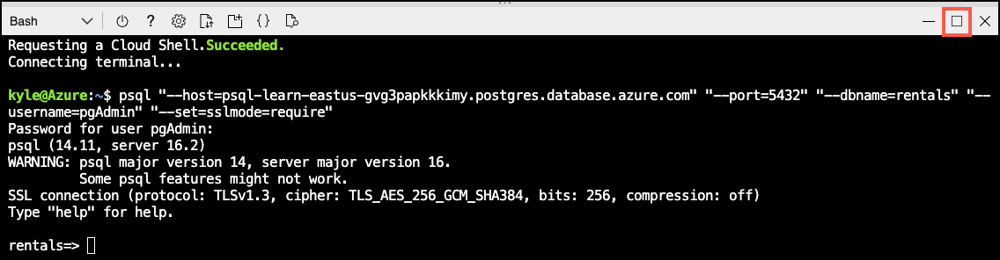

---
lab:
  title: 使用 Azure 机器学习执行推理
  module: Use Azure Machine Learning Inferencing with Azure Database for PostgreSQL
---

# 使用 Azure 机器学习执行推理

作为 Margie's Travel (MT) 的主要开发商，你被要求帮助开发一个功能，估计短期租赁的夜间租金价格。 你已将一些历史数据收集为文本文件，并想要使用它来训练 Azure 机器学习中的简单回归模型。 然后，想要针对 Azure Database for PostgreSQL 灵活服务器数据库中托管的数据使用该模型。

在本练习中，你将部署一个使用 Azure 机器学习的自动化机器学习功能创建的模型。 然后，你将使用该部署的模型来估算短期租赁属性的夜间销售价格。

## 开始之前

你需要具有管理权限的 [Azure 订阅](https://azure.microsoft.com/free)。

### 在你的 Azure 订阅上部署资源

此步骤将指导你使用 Azure Cloud Shell 中的 Azure CLI 命令创建资源组并运行 Bicep 脚本，将完成本练习所需的 Azure 服务部署到 Azure 订阅中。

1. 打开 web 浏览器，导航到 [Azure 门户](https://portal.azure.com/)。

2. 选择 Azure 门户工具栏中的“ **Cloud Shell** ”图标，以打开浏览器窗口底部的新“ [Cloud Shell](https://learn.microsoft.com/azure/cloud-shell/overview) ”窗格。

    

    如果出现提示，请选择打开 *Bash* shell 所需的选项。 如果以前使用过 *PowerShell* 控制台，请将其切换到 *Bash* shell。

3. 在 Cloud Shell 提示符下，输入以下内容以克隆包含练习资源的 GitHub 存储库：

    ```bash
    git clone https://github.com/MicrosoftLearning/mslearn-postgresql.git
    ```

    如果已在上一模块中克隆了此 GitHub 存储库，该存储库仍可供你使用，并且可能会收到以下错误消息：

    ```bash
    fatal: destination path 'mslearn-postgresql' already exists and is not an empty directory.
    ```

    如果收到此消息，可以安全地继续执行下一步。

4. 接下来，运行三个命令来定义变量，以在使用 Azure CLI 命令创建 Azure 资源时减少冗余键入。 变量表示要分配给资源组的名称（`RG_NAME`）、要将资源部署到的 Azure 区域（`REGION`）和随机生成的 PostgreSQL 管理员登录密码（`ADMIN_PASSWORD`）。

    在第一个命令中，分配给相应变量的区域是 `eastus`，但你也可以将其替换为首选位置。 但是，如果替换默认值，则必须选择另一个 [支持抽象摘要的 Azure 区域](https://learn.microsoft.com/azure/ai-services/language-service/summarization/region-support) ，以确保可以完成此学习路径中模块中的所有任务。

    ```bash
    REGION=eastus
    ```

    以下命令分配要用于资源组的名称，该资源组将容纳本练习中使用的所有资源。 分配给相应变量的资源组名称是 `rg-learn-postgresql-ai-$REGION`，其中 `$REGION` 是上文指定的位置。 但是，你可以将它更改为符合偏好的任何其他资源组名称。

    ```bash
    RG_NAME=rg-learn-postgresql-ai-$REGION
    ```

    最后一个命令随机生成 PostgreSQL 管理员登录的密码。 请确保将其复制 到安全位置，以便稍后连接到 PostgreSQL 灵活服务器。

    ```bash
    a=()
    for i in {a..z} {A..Z} {0..9}; 
        do
        a[$RANDOM]=$i
        done
    ADMIN_PASSWORD=$(IFS=; echo "${a[*]::18}")
    echo "Your randomly generated PostgreSQL admin user's password is:"
    echo $ADMIN_PASSWORD
    ```

5. 如果有权访问多个 Azure 订阅，并且默认订阅不是要为此练习创建资源组和其他资源的订阅，请运行此命令来设置相应的订阅，将 `<subscriptionName|subscriptionId>` 令牌替换为要使用的订阅的名称或 ID：

    ```azurecli
    az account set --subscription <subscriptionName|subscriptionId>
    ```

6. 运行以下 Azure CLI 命令创建资源组：

    ```azurecli
    az group create --name $RG_NAME --location $REGION
    ```

7. 最后，使用 Azure CLI 执行 Bicep 部署脚本，在资源组中预配 Azure 资源：

    ```azurecli
    az deployment group create --resource-group $RG_NAME --template-file "mslearn-postgresql/Allfiles/Labs/Shared/deploy-azure-machine-learning.bicep" --parameters adminLogin=pgAdmin adminLoginPassword=$ADMIN_PASSWORD
    ```

    Bicep 部署脚本将完成此练习所需的 Azure 服务预配到你的资源组中。 部署的资源包括 Azure Database for PostgreSQL 灵活服务器和Azure 机器学习工作区。 部署脚本还将创建所有必备服务来实例化 Azure 机器学习工作区，包括 Azure Blob 存储帐户、Azure 密钥库、Azure 容器存储库、Azure Log Analytics 工作区和 Azure 应用程序见解实例。 Bicep 脚本还会执行一些配置步骤，例如将 `azure_ai` 和 `vector` 扩展添加到 PostgreSQL 服务器的_允许列表_中（通过 azure.extensions 服务器参数），并在服务器上创建名为 `rentals` 的数据库。 **请注意，Bicep 文件不同于此学习路径中的其他模块。**

    部署需要数分钟才能完成。 你可以从 Cloud Shell 监视它，也可以导航到上述创建的资源组的“**部署**”页面，在那里观察部署进度。

8. 完成资源部署后，关闭 Cloud Shell 窗格。

### 排查部署错误

运行 Bicep 部署脚本时可能会遇到一些错误。

- 如果你以前为此学习路径运行过 Bicep 部署脚本并随后删除了资源，如果在删除资源后 48 小时内尝试重新运行该脚本，可能会收到如下所示的错误消息：

    ```bash
    {"code": "InvalidTemplateDeployment", "message": "The template deployment 'deploy' is not valid according to the validation procedure. The tracking id is '4e87a33d-a0ac-4aec-88d8-177b04c1d752'. See inner errors for details."}
    
    Inner Errors:
    {"code": "FlagMustBeSetForRestore", "message": "An existing resource with ID '/subscriptions/{subscriptionId}/resourceGroups/rg-learn-postgresql-ai-eastus/providers/Microsoft.CognitiveServices/accounts/{accountName}' has been soft-deleted. To restore the resource, you must specify 'restore' to be 'true' in the property. If you don't want to restore existing resource, please purge it first."}
    ```

    如果收到此消息，请修改上述 `azure deployment group create` 命令，将 `restore` 参数设置为 `true`，然后重新运行。

- 如果所选区域受限于预配特定资源，则必须将 `REGION` 变量设置为其他位置，然后重新运行命令以创建资源组并运行 Bicep 部署脚本。

    ```bash
    {"status":"Failed","error":{"code":"DeploymentFailed","target":"/subscriptions/{subscriptionId}/resourceGroups/{resourceGrouName}/providers/Microsoft.Resources/deployments/{deploymentName}","message":"At least one resource deployment operation failed. Please list deployment operations for details. Please see https://aka.ms/arm-deployment-operations for usage details.","details":[{"code":"ResourceDeploymentFailure","target":"/subscriptions/{subscriptionId}/resourceGroups/{resourceGrouName}/providers/Microsoft.DBforPostgreSQL/flexibleServers/{serverName}","message":"The resource write operation failed to complete successfully, because it reached terminal provisioning state 'Failed'.","details":[{"code":"RegionIsOfferRestricted","message":"Subscriptions are restricted from provisioning in this region. Please choose a different region. For exceptions to this rule please open a support request with Issue type of 'Service and subscription limits'. See https://review.learn.microsoft.com/en-us/azure/postgresql/flexible-server/how-to-request-quota-increase for more details."}]}]}}
    ```

- 如果脚本由于接受负责任的 AI 协议的要求而无法创建 AI 资源，则可能会遇到以下错误：在这种情况下，使用 Azure 门户用户界面创建 Azure AI 服务资源，然后重新运行部署脚本。

    ```bash
    {"code": "InvalidTemplateDeployment", "message": "The template deployment 'deploy' is not valid according to the validation procedure. The tracking id is 'f8412edb-6386-4192-a22f-43557a51ea5f'. See inner errors for details."}
     
    Inner Errors:
    {"code": "ResourceKindRequireAcceptTerms", "message": "This subscription cannot create TextAnalytics until you agree to Responsible AI terms for this resource. You can agree to Responsible AI terms by creating a resource through the Azure Portal then trying again. For more detail go to https://go.microsoft.com/fwlink/?linkid=2164190"}
    ```

## 部署 Azure 机器学习模型

第一步是将模型部署到 Azure 机器学习。 存储库包含一个针对一组列表数据训练的模型示例，将在 PostgreSQL 集成中使用。

1. 从 [mslearn-postgresql 存储库](../../Allfiles/Labs/Shared/mlflow-model.zip)下载 `mlflow-model.zip` 文件。 将文件从此中提取到名为 **mlflow-model** 的文件夹。

2. 在 [Azure 门户](https://portal.azure.com/)中，导航到新建的 Azure 机器学习工作区。

3. 选择“**启动工作室**”按钮以打开 Azure 机器学习工作室。

    

4. 从“**资产**”菜单中选择“**模型**”菜单选项。 然后，选择“**+ 注册**”菜单选项，并选择“**从本地文件**”。

    

5. 在“**上传模型**”菜单中，将模型类型设置为“**MLflow**”。 然后，选择“**浏览**”并导航到“**mlflow-model**”文件夹，上传资产。 之后，选择“**下一步**”按钮以继续。

    

6. 将模型命名为 **RentalListings**，然后选择“**下一步**”按钮。

    

7. 选择“**注册**”按钮完成模型注册。 此操作将返回 **Models** 页面。 选择新建的模型。

> [!Note]
>
> 如果未看到模型，请选择“**刷新**”菜单选项按钮以重新加载页面。 之后，应会看到 **RentalListings** 模型。

8. 选择“**部署**”按钮选项并创建新的**实时终结点**。

    

9. 在部署快捷菜单上，将**虚拟机**设置为类似 **Standard_DS2_v2** 的内容，并将**实例计数**设置为 1。 选择“部署”按钮****。 部署可能需要几分钟才能完成，因为部署过程包括预配虚拟机并将模型部署为 Docker 容器。

    

10. 部署终结点后，导航到“**使用**”选项卡，并复制 REST 终结点和主键，以便在下一部分使用它们。

    

11. 若要测试终结点是否正常运行，可以使用终结点上的“**测试**”选项卡。 然后粘贴以下块，替换当前存在的任何输入。 选择“**测试**”按钮，应会看到一个 JSON 输出，其中包含一个数组，该数组中的单个小数值表示应该期望此特定属性在一夜租赁中赚取的美元数。

    ```json
    {
        "input_data": {
            "columns": [
                "host_is_superhost",
                "host_has_profile_pic",
                "host_identity_verified",
                "neighbourhood_group_cleansed",
                "zipcode",
                "property_type",
                "room_type",
                "accommodates",
                "bathrooms",
                "bedrooms",
                "beds"
            ],
            "index": [0],
            "data": [["0", "0", "0", "Central Area", "98122", "House", "Entire home/apt", 4, 1.5, 3, 3]]
        }
    }
    ```

    

## 在 Azure Cloud Shell 中使用 psql 连接到数据库

在此任务中，你将使用 [psql 命令行实用工具](https://www.postgresql.org/docs/current/app-psql.html)从 [Azure Cloud Shell](https://learn.microsoft.com/azure/cloud-shell/overview) 连接到 Azure Database for PostgreSQL 灵活服务器上的 `rentals` 数据库。

1. 在 [Azure 门户](https://portal.azure.com/)中，导航到新创建的 Azure Database for PostgreSQL 灵活服务器。

2. 在资源菜单中的“**设置**”下，选择“**数据库**”为 `rentals` 数据库选择“**连接**”。

    

3. 在 Cloud Shell 中的“用户 pgAdmin 密码”提示符下，输入随机生成的 **pgAdmin** 登录密码。

    登录后，将显示 `rentals` 数据库的 `psql` 提示。

4. 在本练习的其余部分中，可以继续在 Cloud Shell 中工作，因此选择窗格右上方的 **最大化** 按钮来展开浏览器窗口中的窗格可能会有所帮助。

    

## 安装和配置 `azure_ai` 扩展

在使用 `azure_ai` 扩展之前，必须先将其安装到数据库中，并将其配置为连接到 Azure AI 服务资源。 `azure_ai` 扩展让你能够将 Azure OpenAI 和 Azure AI 语言服务集成到数据库中。 要在数据库中启用该扩展，请执行以下步骤：

1. 在 `psql` 提示符处执行以下命令，验证设置环境时运行的 Bicep 部署脚本是否已成功将 `azure_ai` 扩展和 `vector` 扩展添加到服务器的“_允许列表中_”：

    ```sql
    SHOW azure.extensions;
    ```

    该命令显示服务器“_允许列表_”上的扩展列表。 如果所有内容都正确安装，则输出必须包含 `azure_ai` 和 `vector`，如下所示：

    ```sql
     azure.extensions 
    ------------------
     azure_ai,vector
    ```

    在 Azure Database for PostgreSQL 灵活服务器中安装和使用扩展之前，必须将其添加到服务器的_允许列表_中，如[如何使用 PostgreSQL 扩展](https://learn.microsoft.com/azure/postgresql/flexible-server/concepts-extensions#how-to-use-postgresql-extensions)中所述。

2. 现在，你已准备好使用 [CREATE EXTENSION](https://www.postgresql.org/docs/current/sql-createextension.html) 命令安装 `azure_ai` 扩展。

    ```sql
    CREATE EXTENSION IF NOT EXISTS azure_ai;
    ```

    `CREATE EXTENSION` 通过运行其脚本文件将新扩展加载到数据库中。 此脚本通常会创建新的 SQL 对象，例如函数、数据类型和架构。 如果已存在同名的扩展，则会引发错误。 添加 `IF NOT EXISTS` 允许命令在已经安装的情况下执行，而不会引发错误。

3. 然后，必须使用 `azure_ai.set_setting()` 函数配置与 Azure 机器学习部署终结点的连接。 将 `azure_ml` 设置配置为指向已部署的终结点及其密钥。 `azure_ml.scoring_endpoint` 的值将为终结点的 REST URL。 `azure_ml.endpoint_key` 的值将为密钥 1 或密钥 2 的值。

    ```sql
    SELECT azure_ai.set_setting('azure_ml.scoring_endpoint','https://<YOUR_ENDPOINT>.<YOUR_REGION>.inference.ml.azure.com/score');
    ```

    ```sql
    SELECT azure_ai.set_setting('azure_ml.endpoint_key', '<YOUR_KEY>');
    ```

## 创建包含要对挂牌价格定价的表

需要一个表来存储要定价的短期租赁挂牌价格。

1. 在 `rentals` 数据库中运行以下命令以新建 `listings_to_price` 表。

    ```sql
    CREATE TABLE listings_to_price (
        id INT GENERATED BY DEFAULT AS IDENTITY PRIMARY KEY,
        host_is_superhost INT NOT NULL,
        host_has_profile_pic INT NOT NULL,
        host_identity_verified INT NOT NULL,
        neighbourhood_group_cleansed VARCHAR(75) NOT NULL,
        zipcode VARCHAR(5) NOT NULL,
        property_type VARCHAR(30) NOT NULL,
        room_type VARCHAR(30) NOT NULL,
        accommodates INT NOT NULL,
        bathrooms DECIMAL(3,1) NOT NULL,
        bedrooms INT NOT NULL,
        beds INT NOT NULL
    );
    ```

2. 接下来，在 `rentals` 数据库中运行以下命令以插入新的租赁挂牌价格数据。

    ```sql
    INSERT INTO listings_to_price(host_is_superhost, host_has_profile_pic, host_identity_verified,
        neighbourhood_group_cleansed, zipcode, property_type, room_type,
        accommodates, bathrooms, bedrooms, beds)
    VALUES
        (1, 1, 1, 'Queen Anne', '98119', 'House', 'Private room', 2, 1.0, 1, 1),
        (0, 1, 1, 'University District', '98105', 'Apartment', 'Entire home/apt', 4, 1.5, 2, 2),
        (0, 0, 0, 'Central Area', '98122', 'House', 'Entire home/apt', 4, 1.5, 3, 3),
        (0, 0, 0, 'Downtown', '98101', 'House', 'Entire home/apt', 4, 1.5, 3, 3),
        (0, 0, 0, 'Capitol Hill', '98122', 'House', 'Entire home/apt', 4, 1.5, 3, 3);
    ```

    此命令插入五行新的挂牌价格数据。

## 创建用于转换挂牌价格数据的函数

若要填充语言翻译表，你将创建一个存储过程以批量加载数据。

1. 在 `psql` 提示符处运行以下命令，以新建名为 `price_listing` 的函数。

    ```sql
    CREATE OR REPLACE FUNCTION price_listing (
        IN host_is_superhost INT, IN host_has_profile_pic INT, IN host_identity_verified INT,
        IN neighbourhood_group_cleansed VARCHAR(75), IN zipcode VARCHAR(5), IN property_type VARCHAR(30),
        IN room_type VARCHAR(30), IN accommodates INT, IN bathrooms DECIMAL(3,1), IN bedrooms INT, IN beds INT)
    RETURNS DECIMAL(6,2)
    AS $$
        SELECT CAST(jsonb_array_elements(inference.inference) AS DECIMAL(6,2)) AS expected_price
        FROM azure_ml.inference(('
        {
            "input_data": {
                "columns": [
                    "host_is_superhost",
                    "host_has_profile_pic",
                    "host_identity_verified",
                    "neighbourhood_group_cleansed",
                    "zipcode",
                    "property_type",
                    "room_type",
                    "accommodates",
                    "bathrooms",
                    "bedrooms",
                    "beds"
                ],
                "index": [0],
                "data": [["' || host_is_superhost || '", "' || host_has_profile_pic || '", "' || host_identity_verified || '", "' ||
                neighbourhood_group_cleansed || '", "' || zipcode || '", "' || property_type || '", "' || room_type || '", ' ||
                accommodates || ', ' || bathrooms || ', ' || bedrooms || ', ' || beds || ']]
            }
        }')::jsonb, deployment_name=>'rentallistings-1');
    $$ LANGUAGE sql;
    ```

> [!Note]
>
> 默认情况下，部署名称为模型名称 (**rentallistings**) 和版本号 (**1**) 的组合。 如果部署新版模型并使用默认部署名称，则新部署名称将为 **rentallistings-2**。

2. 使用以下 SQL 命令执行函数：

    ```sql
    SELECT * FROM price_listing(0, 0, 0, 'Central Area', '98122', 'House', 'Entire home/apt', 4, 1.5, 3, 3);
    ```

    此查询以十进制格式返回夜间租金估算值。

3. 使用以下 SQL 命令对 `listings_to_price` 表中的每一行调用函数：

    ```sql
    SELECT l2p.*, expected_price
    FROM listings_to_price l2p
        CROSS JOIN LATERAL price_listing(l2p.host_is_superhost, l2p.host_has_profile_pic, l2p.host_identity_verified,
            l2p.neighbourhood_group_cleansed, l2p.zipcode, l2p.property_type, l2p.room_type,
            l2p.accommodates, l2p.bathrooms, l2p.bedrooms, l2p.beds) expected_price;
    ```

    此查询返回五行，`listings_to_price` 中每个查询一行。 它将包括 `listings_to_price` 表中的所有列，以及 `price_listing()` 函数的结果作为 `expected_price`。

## 清理

完成本练习后，请删除创建的 Azure 资源。 你需要为配置的容量（而不是数据库的使用量）付费。 按照这些说明删除资源组和为此实验室创建的所有资源。

1. 打开 Web 浏览器并导航到 [Azure 门户](https://portal.azure.com/)，然后在主页上选择 Azure 服务下的**资源组**。

    

2. 在任何字段搜索框的筛选器中，输入为此实验室创建的资源组的名称，然后从列表中选择该资源组。

3. 在资源组的“概述”页面中，选择“删除资源组” 。

    

4. 在确认对话框中，输入要删除的资源组名称进行确认，然后选择“**删除**”。
